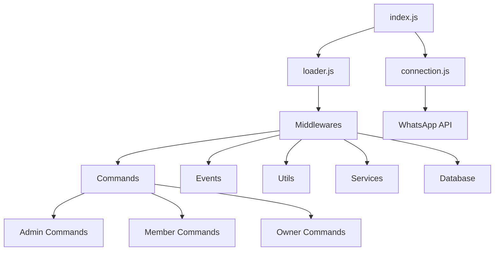

# Contexto do Projeto

## Visão Geral do NeroBot

O NeroBot é um bot de WhatsApp multifunções desenvolvido em JavaScript utilizando a biblioteca Baileys para interação com a API do WhatsApp. O bot foi projetado para oferecer diversas funcionalidades através de comandos que podem ser acionados por usuários em grupos ou conversas privadas.

## Objetivo da Migração para TypeScript

A migração para TypeScript visa melhorar a robustez e manutenibilidade do código através da adição de tipagem estática, mantendo todas as funcionalidades atuais exatamente como estão. Os principais benefícios esperados incluem:

- Detecção precoce de erros em tempo de compilação
- Melhor documentação do código através de interfaces e tipos
- Autocomplete e intellisense mais eficientes no desenvolvimento
- Maior facilidade de manutenção e expansão do código no futuro
- Maior confiabilidade do código em produção

## Arquitetura Atual

O NeroBot possui uma arquitetura modular dividida em várias camadas:

### Componentes Principais

#### 1. Conexão (connection.js)
Responsável por estabelecer e manter a conexão com a API do WhatsApp utilizando a biblioteca Baileys. Gerencia autenticação, reconexão automática e tratamento de eventos de conexão.

#### 2. Carregador (loader.js)
Carrega os comandos e configura os listeners de eventos para processar mensagens e eventos do WhatsApp.

#### 3. Middlewares
Processam mensagens e eventos antes de encaminhá-los para os comandos apropriados. Incluem verificação de permissões, filtragem de mensagens e processamento inicial.

#### 4. Comandos
Organizados em três categorias baseadas em permissões:
- **Admin**: Comandos que só podem ser executados por administradores do grupo
- **Member**: Comandos que podem ser executados por qualquer membro
- **Owner**: Comandos exclusivos para o dono do bot/grupo

#### 5. Utilitários
Funções auxiliares utilizadas por diversos componentes do sistema, como formatação de mensagens, manipulação de arquivos, etc.

#### 6. Serviços
Integração com APIs externas e funcionalidades específicas isoladas em módulos próprios.

#### 7. Banco de Dados
Armazenamento e recuperação de dados persistentes, como configurações e informações de grupos.

## Tecnologias Utilizadas

### Principais Dependências
- **Baileys**: Biblioteca para interação com a API do WhatsApp
- **@cacheable/node-cache**: Sistema de cache para otimização
- **axios**: Cliente HTTP para requisições externas
- **correios-brasil**: API para consulta de informações de rastreamento
- **hercai**: Biblioteca para integração com IA
- **pino**: Sistema de logging

### Ambiente de Execução
- **Node.js**: Plataforma de execução JavaScript
- **npm**: Gerenciador de pacotes

## Fluxo de Trabalho do Bot

1. O bot inicia estabelecendo uma conexão com o WhatsApp
2. Registra listeners para eventos como mensagens e atualizações de grupo
3. Quando uma mensagem é recebida, os middlewares processam e verificam se é um comando
4. Se for um comando, o sistema identifica o comando correspondente e verifica permissões
5. O comando é executado e uma resposta é enviada de volta ao WhatsApp
6. O bot continua aguardando novas mensagens e eventos

## Restrições e Requisitos

### Restrições
- Manter o funcionamento das funções exatamente como estão atualmente
- Preservar todos os outputs de terminal exatamente como estão no código original
- Qualquer log temporário adicionado deve ser claramente marcado com comentários
- Modificações nos outputs serão permitidas apenas após a migração completa

### Requisitos
- Adicionar tipagem estática a todos os componentes do sistema
- Otimizar o código aproveitando os recursos do TypeScript
- Garantir que todas as funções mantêm seu comportamento original
- Manter a codebase e estrutura do projeto limpa e organizada
- Assegurar compatibilidade com as versões atuais das dependências

## Ambiente de Desenvolvimento

### Configuração Atual
- Sistema operacional: Windows
- Editor: Visual Studio Code
- Controle de versão: Git
- Execução: Node.js com flag --watch para desenvolvimento

### Configuração Futura (TypeScript)
- Adição de TypeScript e suas dependências
- Configuração do tsconfig.json
- Scripts de build e desenvolvimento
- Possível adição de linters e formatadores específicos para TypeScript

## Glossário

| Termo | Descrição |
|-------|-----------|
| Baileys | Biblioteca JavaScript para interação com a API não-oficial do WhatsApp |
| Socket | Instância de conexão com o WhatsApp |
| Middleware | Função que processa dados antes de passá-los para o destino final |
| Command | Funcionalidade acionada por comando específico de usuário |
| Handler | Função que manipula eventos ou comandos específicos |
| JID | ID de usuário ou grupo no formato do WhatsApp |
| BASE_DIR | Variável global que armazena o diretório base do projeto |

## Histórico do Projeto

O projeto foi inicialmente desenvolvido em JavaScript como um bot de WhatsApp multifunções, com foco em facilidade de uso e extensibilidade. A atual migração para TypeScript representa uma evolução natural buscando maior robustez e manutenibilidade, sem alterar as funcionalidades já implementadas e apreciadas pelos usuários. 