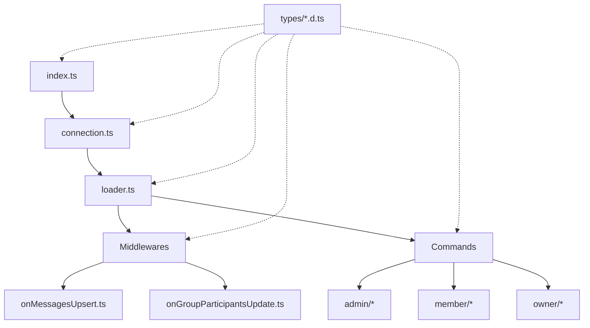

# Guia do Desenvolvedor - NeroBot

## Início Rápido

### Pré-requisitos

- Node.js v16.0.0 ou superior
- npm v7.0.0 ou superior
- Git

### Instalação e Configuração

1. Clone o repositório:
   ```bash
   git clone https://github.com/AnthonyVeras/NeroBot.git
   cd NeroBot
   ```

2. Instale as dependências:
   ```bash
   npm install
   ```

3. Configure as variáveis de ambiente:
   - Crie um arquivo `.env` na raiz do projeto
   - Copie o conteúdo de `.env.example` e preencha com suas configurações

4. Compilar o código TypeScript:
   ```bash
   npm run build
   ```

5. Iniciar o bot em modo de desenvolvimento:
   ```bash
   npm run dev
   ```

### Primeiro Uso

Ao iniciar o bot pela primeira vez, você será solicitado a informar um número de telefone para autenticação. O bot fornecerá um código de pareamento que deve ser usado para vincular o WhatsApp no seu dispositivo.

## Arquitetura e Estrutura do Código

### Visão Geral

O NeroBot segue uma arquitetura modular com componentes bem definidos, agora implementados totalmente em TypeScript:



### Sistema de Tipos

O projeto utiliza TypeScript para proporcionar tipagem estática e melhorar a manutenção do código. Os principais tipos estão definidos em:

- `src/types/baileys.d.ts`: Tipos relacionados à API do WhatsApp
- `src/types/commands.d.ts`: Interfaces para o sistema de comandos
- `src/types/config.d.ts`: Tipos para configurações do sistema
- `src/types/global.d.ts`: Tipos e interfaces globais

#### Exemplos de Tipos Importantes

**WaBotClient** - Cliente WhatsApp estendido:
```typescript
export interface WaBotClient extends WASocket {
  sendText: (jid: string, text: string, quoted?: WaBotMessage) => Promise<proto.WebMessageInfo>;
  reply: (jid: string, text: string, quoted: WaBotMessage) => Promise<proto.WebMessageInfo>;
  // ... outros métodos
}
```

**WaBotMessage** - Mensagem do WhatsApp:
```typescript
export interface WaBotMessage extends proto.IWebMessageInfo {
  body?: string;
  from?: string;
}
```

**CommonFunctions** - Interface para funções comuns disponíveis nos comandos:
```typescript
interface CommonFunctions {
  args: string[];
  commandName: string | null;
  // ... outras propriedades
  sendReply: (text: string) => Promise<proto.WebMessageInfo | undefined>;
  sendImageFromURL: (url: string, caption?: string) => Promise<proto.WebMessageInfo | undefined>;
  // ... outros métodos
}
```

### Middlewares

Os middlewares são componentes que processam eventos recebidos do WhatsApp. Todos estão localizados em `src/middlewares/` e incluem:

1. **onMessagesUpsert.ts**: Processa novas mensagens recebidas
2. **onGroupParticipantsUpdate.ts**: Lida com entrada/saída de participantes em grupos

### Fluxo de Dados

1. O usuário envia uma mensagem para o WhatsApp
2. A biblioteca Baileys recebe o evento e o repassa para o `connection.ts`
3. O evento é processado pelos listeners configurados em `loader.ts`
4. Os middlewares analisam a mensagem para identificar comandos
5. Se um comando for identificado, ele é executado com os parâmetros apropriados
6. O resultado do comando é enviado de volta ao usuário via WhatsApp

## Adicionando Novos Comandos

### Estrutura Básica de um Comando

Crie um novo arquivo TypeScript na pasta apropriada dentro de `src/commands/`:
- `admin/` para comandos administrativos
- `member/` para comandos gerais
- `owner/` para comandos restritos ao dono

Estrutura básica de um comando:

```typescript
import { PREFIX } from '../../config';
import { Command } from '../../types/commands';

const myCommand: Command = {
  name: 'exemplo',
  description: 'Um comando de exemplo',
  commands: ['exemplo', 'ex'],
  usage: `${PREFIX}exemplo [parâmetro]`,
  handle: async ({ 
    socket, 
    remoteJid, 
    userJid, 
    args, 
    sendReply 
  }) => {
    // Seu código aqui
    await sendReply('Este é um comando de exemplo!');
  },
};

export default myCommand;
```

### Parâmetros Disponíveis no Handler

| Parâmetro | Tipo | Descrição |
|-----------|------|-----------|
| `socket` | `WASocket` | Socket do WhatsApp para operações avançadas |
| `remoteJid` | `string` | ID do grupo/chat onde a mensagem foi enviada |
| `userJid` | `string` | ID do usuário que enviou a mensagem |
| `args` | `string[]` | Argumentos passados para o comando (array) |
| `fullArgs` | `string` | Argumentos completos como string |
| `commandName` | `string` | Nome do comando acionado |
| `fullMessage` | `string` | Mensagem completa recebida |
| `isImage` | `boolean` | Se a mensagem contém uma imagem |
| `isVideo` | `boolean` | Se a mensagem contém um vídeo |
| `isSticker` | `boolean` | Se a mensagem contém um sticker |
| `isReply` | `boolean` | Se a mensagem é uma resposta a outra |
| `replyJid` | `string` | ID da mensagem sendo respondida |
| `type` | `'admin' \| 'member' \| 'owner'` | Tipo do comando |

### Funções de Resposta Disponíveis

| Função | Descrição |
|--------|-----------|
| `sendReply(message)` | Envia uma mensagem como resposta |
| `sendText(message, mentions)` | Envia uma mensagem de texto |
| `sendErrorReply(message)` | Envia uma mensagem de erro |
| `sendWarningReply(message)` | Envia uma mensagem de aviso |
| `sendSuccessReply(message)` | Envia uma mensagem de sucesso |
| `sendImageFromURL(url)` | Envia uma imagem a partir de URL |
| `sendImageFromFile(path)` | Envia uma imagem a partir de arquivo |
| `sendStickerFromURL(url)` | Envia um sticker a partir de URL |
| `sendStickerFromFile(path)` | Envia um sticker a partir de arquivo |
| `sendAudioFromURL(url)` | Envia um áudio a partir de URL |
| `sendVideoFromURL(url)` | Envia um vídeo a partir de URL |
| `downloadImage()` | Baixa uma imagem da mensagem atual |
| `downloadSticker()` | Baixa um sticker da mensagem atual |
| `downloadVideo()` | Baixa um vídeo da mensagem atual |
| `sendReact(emoji)` | Envia uma reação com emoji |
| `sendWaitReact()` | Envia uma reação de espera |
| `sendSuccessReact()` | Envia uma reação de sucesso |
| `sendErrorReact()` | Envia uma reação de erro |
| `sendWarningReact()` | Envia uma reação de aviso |

### Exemplo Completo

```typescript
import { PREFIX } from '../../config';
import { Command } from '../../types/commands';
import { InvalidParameterError } from '../../errors/InvalidParameterError';

const echoCommand: Command = {
  name: 'echo',
  description: 'Repete o texto enviado pelo usuário',
  commands: ['echo', 'repetir'],
  usage: `${PREFIX}echo [texto]`,
  handle: async ({ 
    args, 
    sendReply, 
    sendWaitReact,
    sendSuccessReact 
  }) => {
    // Envia reação de espera
    await sendWaitReact();
    
    // Verifica se há texto para repetir
    if (!args.length) {
      throw new InvalidParameterError(
        `Você precisa informar um texto. Exemplo: ${PREFIX}echo Olá Mundo!`
      );
    }
    
    // Obtém o texto a ser repetido
    const textToEcho = args.join(' ');
    
    // Envia a resposta
    await sendReply(`🔄 *Echo:* ${textToEcho}`);
    
    // Envia reação de sucesso
    await sendSuccessReact();
  },
};

export default echoCommand;
```

## Tratamento de Erros

### Classes de Erro Disponíveis

| Classe | Uso |
|--------|-----|
| `InvalidParameterError` | Parâmetros inválidos ou faltando |
| `WarningError` | Avisos não críticos |
| `DangerError` | Erros críticos |

### Exemplo de Uso

```typescript
import { InvalidParameterError } from '../../errors/InvalidParameterError';

// ...

if (!args.length) {
  throw new InvalidParameterError('Parâmetro obrigatório não informado');
}
```

O sistema de tratamento de erros automaticamente enviará mensagens apropriadas para o usuário.

## Boas Práticas

### Comandos

- Mantenha comandos simples e com propósito único
- Valide todos os parâmetros antes de processar
- Use reações para indicar o estado do processamento
- Adicione mensagens de ajuda claras
- Siga o padrão de outros comandos para consistência

### TypeScript

- Defina tipos explícitos para APIs públicas
- Evite o uso de `any`
- Use `readonly` para arrays e propriedades imutáveis
- Utilize interfaces para objetos e tipos para unions
- Documente funções com JSDoc

### Performance

- Minimize chamadas à API do WhatsApp
- Use cache para operações repetitivas
- Evite loops aninhados em operações frequentes
- Libere recursos após o uso (feche streams, etc.)
- Utilize operações assíncronas apropriadamente

## Solução de Problemas Comuns

### O Bot Não Conecta

1. Verifique se as credenciais estão corretas
2. Verifique se a pasta `assets/auth/baileys` existe e tem permissões
3. Tente excluir a pasta `assets/auth/baileys` e reiniciar o bot
4. Verifique os logs em busca de erros específicos

### Comandos Não São Reconhecidos

1. Verifique se o comando está na pasta correta
2. Verifique se o nome do comando está listado no array `commands`
3. Verifique se o arquivo é exportado corretamente como default
4. Reinicie o bot para que novos comandos sejam carregados

### Erros TypeScript

1. Verifique se todos os tipos estão corretamente definidos
2. Execute `npm run build` para verificar erros de compilação
3. Verifique se as dependências têm definições de tipo (@types)
4. Utilize o linting: `npm run lint`

## FAQ - Perguntas Frequentes

### Como adicionar um comando que só funciona em grupos?

Verifique se o `remoteJid` é um grupo usando a função helper:

```typescript
import { isGroupJid } from '../../utils/jidHelpers';

// ...
if (!isGroupJid(remoteJid)) {
  throw new WarningError('Este comando só pode ser usado em grupos!');
}
```

### Como adicionar um comando que requer mídia?

Verifique os flags de mídia e use as funções de download:

```typescript
if (!isImage) {
  throw new InvalidParameterError('Envie uma imagem junto com o comando!');
}

const imageBuffer = await downloadImage();
// Processar a imagem...
```

### Como criar um comando com subcomandos?

Use o primeiro argumento para determinar o subcomando:

```typescript
const subCommand = args[0]?.toLowerCase();
const subArgs = args.slice(1);

switch (subCommand) {
  case 'add':
    // Lógica para adicionar
    break;
  case 'remove':
    // Lógica para remover
    break;
  default:
    throw new InvalidParameterError(
      `Subcomando inválido! Opções: add, remove. Exemplo: ${PREFIX}comando add`
    );
}
```

## Recursos e Referências

### Documentação Oficial

- [Documentação Baileys](https://github.com/whiskeysockets/baileys)
- [Documentação TypeScript](https://www.typescriptlang.org/docs/)
- [API do WhatsApp Web](https://github.com/WhatsApp/WhatsApp-Web-API)

### Ferramentas Úteis

- [TypeScript Playground](https://www.typescriptlang.org/play)
- [WhatsApp API Tester](https://msglab.co/whatsapp)
- [Baileys Test Server](https://github.com/whiskeysockets/baileys-test-server)

## Contato e Suporte

Se você encontrar problemas ou tiver dúvidas sobre o desenvolvimento:

- Abra uma issue no repositório
- Entre em contato com o mantenedor principal
- Consulte a documentação interna adicional

## Glossário

| Termo | Descrição |
|-------|-----------|
| JID | Jabber ID - identificador de usuário/grupo no WhatsApp |
| Socket | Interface de comunicação com a API do WhatsApp |
| Handler | Função que processa um comando ou evento |
| Middleware | Função que processa mensagens antes dos comandos |
| Baileys | Biblioteca para interação com WhatsApp Web |
| PREFIX | Prefixo usado para identificar comandos (ex: "!") | 