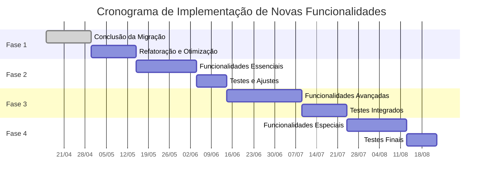

# Plano de Implementação de Novas Funcionalidades

## Visão Geral

Este documento detalha o plano de implementação para novas funcionalidades no NeroBot após a conclusão da migração para TypeScript. O objetivo é aproveitar as vantagens da tipagem estática e outros recursos do TypeScript para expandir as capacidades do bot de forma organizada e estruturada.

## Critérios de Priorização

As novas funcionalidades serão priorizadas com base nos seguintes critérios:

| Critério | Peso | Descrição |
|----------|------|-----------|
| Valor para usuários | Alto | Impacto positivo na experiência dos usuários do bot |
| Complexidade técnica | Médio | Dificuldade de implementação e integração |
| Dependências | Alto | Se depende de outras funcionalidades ou componentes |
| Esforço de desenvolvimento | Médio | Tempo e recursos necessários para implementação |
| Manutenibilidade | Alto | Facilidade de manutenção a longo prazo |
| Compatibilidade | Alto | Compatibilidade com a infraestrutura existente |

## Cronograma de Implementação

## Novas Funcionalidades Planejadas

### Fase 1: Essenciais (Após Conclusão da Migração)

| ID | Funcionalidade | Descrição | Prioridade | Estimativa |
|----|---------------|-----------|------------|------------|
| F1.1 | Sistema de Menus Interativos | Menus interativos usando botões e listas do WhatsApp | Alta | 1 semana |
| F1.2 | Persistência Aprimorada | Melhorias no sistema de banco de dados com tipagem | Alta | 1 semana |
| F1.3 | Sistema de Logs Avançado | Logs estruturados e com níveis de severidade | Média | 3 dias |
| F1.4 | Gerenciamento de Grupos | Funcionalidades avançadas para administração de grupos | Alta | 1 semana |
| F1.5 | Controle de Fluxo de Mensagens | Sistema para limitar mensagens por período | Média | 4 dias |

### Fase 2: Avançadas

| ID | Funcionalidade | Descrição | Prioridade | Estimativa |
|----|---------------|-----------|------------|------------|
| F2.1 | Integração com APIs Externas | Framework para integração fácil com APIs | Alta | 2 semanas |
| F2.2 | Comandos Multiestágio | Sistema para comandos que necessitam múltiplas interações | Alta | 1 semana |
| F2.3 | Agendamento de Tarefas | Sistema para programar ações futuras | Média | 1 semana |
| F2.4 | Mecanismo de Plugins | Arquitetura para plugins de terceiros | Baixa | 2 semanas |
| F2.5 | Tradução Automática | Suporte para múltiplos idiomas | Baixa | 1 semana |

### Fase 3: Especiais

| ID | Funcionalidade | Descrição | Prioridade | Estimativa |
|----|---------------|-----------|------------|------------|
| F3.1 | Processamento de Imagens | Manipulação e geração de imagens | Média | 2 semanas |
| F3.2 | Reconhecimento de Voz | Conversão de áudio para texto | Baixa | 2 semanas |
| F3.3 | Dashboard Web | Interface web para monitoramento e configuração | Média | 3 semanas |
| F3.4 | Integração com IA Avançada | Uso de modelos mais sofisticados para respostas | Alta | 2 semanas |
| F3.5 | Automações Customizáveis | Sistema para usuários criarem automações próprias | Baixa | 2 semanas |

## Detalhamento das Principais Funcionalidades

### F1.1: Sistema de Menus Interativos

**Descrição:** Implementação de menus interativos utilizando os recursos de botões e listas do WhatsApp, permitindo navegação mais intuitiva pelos comandos do bot.

**Requisitos:**
- Interface para criação de menus tipados
- Gerenciamento de estados de menus
- Callback handlers para interações
- Timeout para expiração de menus
- Suporte a submenus aninhados

**Dependências:**
- Migração completa dos sistemas de mensagens
- Aprimoramento da tipagem para eventos do WhatsApp

**Impacto no Sistema:**
Médio - Requer adição de novos tipos de manipuladores de eventos e estados.

**Riscos:**
- Compatibilidade com diferentes clientes WhatsApp
- Limitações da API do WhatsApp para interações

### F2.1: Integração com APIs Externas

**Descrição:** Framework para facilitar a integração com APIs externas, incluindo autenticação, cache, rate limiting e tratamento de erros.

**Requisitos:**
- Sistema de configuração por API
- Tipagem para requests e responses
- Cache configurável por endpoint
- Tratamento de erros padronizado
- Retry policies

**Dependências:**
- Sistema de persistência aprimorado
- Sistema de logs avançado

**Impacto no Sistema:**
Alto - Permite expansão significativa das capacidades do bot.

**Riscos:**
- Dependência de serviços externos
- Potencial uso excessivo de recursos
- Complexidade de manutenção

## Estimativas de Esforço e Recursos

| Fase | Esforço Total | Recursos Necessários | 
|------|---------------|----------------------|
| Fase 1 | ~4 semanas | 1 desenvolvedor principal |
| Fase 2 | ~7 semanas | 1-2 desenvolvedores |
| Fase 3 | ~10 semanas | 2 desenvolvedores + especialistas por área |

## Processo de Validação e Aceitação

### Critérios de Aceitação

Cada nova funcionalidade deverá atender aos seguintes critérios antes de ser considerada concluída:

1. **Cobertura de Testes:** Mínimo de 80% de cobertura para novas funcionalidades
2. **Documentação:** Documentação completa incluindo exemplos de uso
3. **Revisão de Código:** Aprovação por pelo menos um revisor
4. **Validação Funcional:** Testes em ambientes de desenvolvimento e staging
5. **Performance:** Não deve degradar a performance geral do sistema

### Processo de Validação

1. Desenvolvimento em branch específica
2. Testes unitários e de integração automatizados
3. Revisão de código por pares
4. Testes de aceitação em ambiente de staging
5. Período de beta com usuários selecionados (quando aplicável)
6. Merge para branch principal

## Riscos e Mitigações

| Risco | Probabilidade | Impacto | Mitigação |
|-------|--------------|---------|-----------|
| Incompatibilidade com atualizações da API do WhatsApp | Alta | Alto | Monitoramento constante das alterações da API, testes automatizados |
| Sobrecarga de recursos do servidor | Média | Alto | Implementação de rate limiting, monitoramento de performance |
| Complexidade excessiva | Média | Médio | Revisões de código frequentes, refatoração quando necessário |
| Dependências externas instáveis | Alta | Médio | Fallbacks para funcionalidades críticas, cache robusto |
| Segurança de dados | Média | Alto | Revisões de segurança, sanitização de inputs, limitação de acessos |

## Atualização do Plano

Este plano será revisado e atualizado mensalmente, ou sempre que houver mudanças significativas nos requisitos ou no ambiente de desenvolvimento. Qualquer alteração será comunicada a todos os envolvidos no desenvolvimento. 