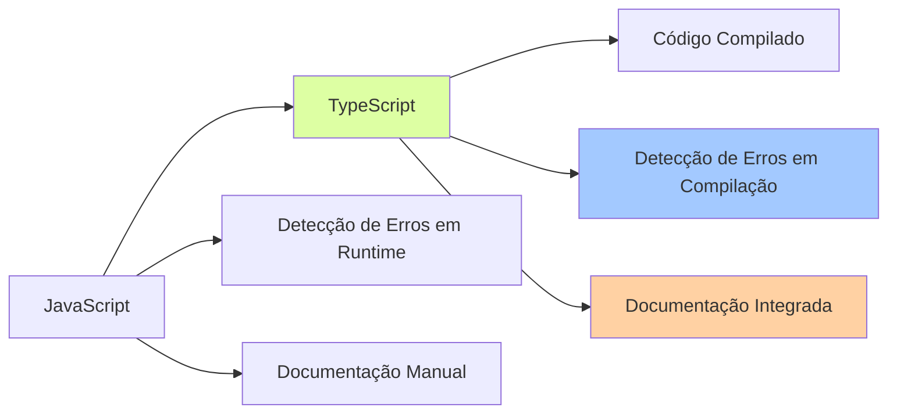

# Principais Mudanças na Migração para TypeScript

## Visão Geral

Este documento registra as principais mudanças realizadas durante a migração do NeroBot de JavaScript para TypeScript. O objetivo é fornecer uma visão clara das alterações implementadas, suas motivações e impactos no sistema.

## Alterações Recentes

### Correção do Repositório (15/03/2024)

- **Alteração**: Mudança do nome do repositório de NeroBotApp para NeroBot
- **Motivação**: Manter consistência com o nome real do projeto e evitar confusão
- **Detalhes da Implementação**: 
  - Recriação do repositório com o nome correto
  - Atualização das referências na documentação
  - Configuração adequada do .gitignore para excluir arquivos desnecessários (incluindo .cursor/rules/)
  - Transferência de todos os arquivos para o novo repositório mantendo o histórico de commits

## Comparação Antes/Depois

### Estrutura do Projeto

| Aspecto | Antes (JavaScript) | Depois (TypeScript) | Impacto |
|---------|-------------------|-------------------|---------|
| Extensão dos arquivos | `.js` | `.ts` | Melhor indicação do tipo de arquivo |
| Estrutura de diretórios | Simples | Expandida com `/types` | Melhor organização |
| Ponto de entrada | `index.js` | `src/index.ts` | Estrutura mais clara |
| Arquivos compilados | Não aplicável | Pasta `dist/` | Separação entre fonte e código compilado |
| Configuração | Esparsa | Centralizada em `tsconfig.json` | Consistência no projeto |

### Aspectos de Código

| Aspecto | Antes (JavaScript) | Depois (TypeScript) | Benefícios |
|---------|-------------------|-------------------|------------|
| Declaração de variáveis | Tipagem dinâmica | Tipagem estática | Maior segurança, detecção de erros em tempo de compilação |
| Funções | Parâmetros não tipados | Parâmetros e retornos tipados | Maior clareza, prevenção de erros |
| Objetos | Estrutura implícita | Interfaces explícitas | Melhor documentação, auto-completar avançado |
| Importações | CommonJS (`require()`) | ES Modules (`import`) | Sintaxe moderna, melhor suporte a tree-shaking |
| Documentação | Comentários simples | JSDoc tipado | Documentação integrada à IDE |



## Melhorias de Tipagem Implementadas

### Tipos de Mensagens

**Antes:**
```javascript
function processMessage(message) {
  if (message.type === 'chat') {
    // processar mensagem de texto
  } else if (message.hasMedia) {
    // processar mídia
  }
}
```

**Depois:**
```typescript
type MessageType = 'chat' | 'image' | 'video' | 'sticker' | 'audio';

interface Message {
  type: MessageType;
  content: string;
  hasMedia: boolean;
  mediaUrl?: string;
  // outros campos...
}

function processMessage(message: Message): void {
  if (message.type === 'chat') {
    // processar mensagem de texto
  } else if (message.hasMedia) {
    // processar mídia
  }
}
```

### Sistema de Comandos

**Antes:**
```javascript
module.exports = {
  name: 'comando',
  description: 'Descrição do comando',
  commands: ['comando1', 'comando2'],
  usage: `${PREFIX}comando`,
  handle: async ({ socket, remoteJid, args }) => {
    // código do comando
  }
};
```

**Depois:**
```typescript
import { Command, CommandHandler } from '../../types/commands';

const myCommand: Command = {
  name: 'comando',
  description: 'Descrição do comando',
  commands: ['comando1', 'comando2'],
  usage: `${PREFIX}comando`,
  handle: async ({ 
    socket, 
    remoteJid, 
    args 
  }: CommandHandler): Promise<void> => {
    // código do comando
  }
};

export default myCommand;
```

### Tratamento de Erros

**Antes:**
```javascript
class InvalidParameterError extends Error {
  constructor(message) {
    super(message);
    this.name = 'InvalidParameterError';
  }
}
```

**Depois:**
```typescript
export class InvalidParameterError extends Error {
  constructor(message: string) {
    super(message);
    this.name = 'InvalidParameterError';
    
    // Corrige problema de herança em TypeScript
    Object.setPrototypeOf(this, InvalidParameterError.prototype);
  }
}
```

## Principais Componentes Refatorados

### Middlewares

A estrutura de middlewares foi fortemente tipada para garantir manipulação segura dos eventos:

```typescript
export interface MiddlewareParams {
  socket: WASocket;
  messages: WAMessage[];
}

export type MiddlewareHandler = (params: MiddlewareParams) => Promise<void>;

export interface GroupParticipantUpdateParams {
  socket: WASocket;
  groupParticipantsUpdate: GroupParticipantsUpdate;
}

export type GroupParticipantUpdateHandler = (
  params: GroupParticipantUpdateParams
) => Promise<void>;
```

### Conexão com WhatsApp

O sistema de conexão foi totalmente tipado, garantindo manipulação correta de eventos e configurações:

```typescript
export interface ConnectionOptions {
  restartOnDisconnect: boolean;
  maxRetryAttempts: number;
  logger: Logger;
}

export async function connect(
  options: ConnectionOptions = defaultOptions
): Promise<WASocket> {
  // Implementação...
}
```

### Sistema de Banco de Dados

Interfaces precisas foram criadas para representar as estruturas do banco de dados:

```typescript
export interface GroupConfig {
  id: string;
  isActive: boolean;
  isAntiLinkActive: boolean;
  isAutoResponderActive: boolean;
  ownerJid: string;
  welcomeMessage?: string;
  goodbyeMessage?: string;
}

export interface AutoResponder {
  id: string;
  trigger: string;
  response: string;
  groupId: string;
}
```

## Otimizações Realizadas

Durante a migração, várias otimizações foram implementadas:

1. **Carregamento Preguiçoso (Lazy Loading)**: Implementação de carregamento preguiçoso de módulos para melhorar performance

2. **Uso de Constantes**: Substituição de strings mágicas por constantes tipadas

3. **Refatoração de Loops**: Otimização de loops usando métodos de array mais eficientes

4. **Melhoria de Funções Async/Await**: Melhor tratamento de promises e funções assíncronas

5. **Tipos Utilitários**: Criação de tipos utilitários para reduzir duplicação de código

## Impacto no Desempenho e Manutenibilidade

| Aspecto | Impacto | Observações |
|---------|--------|-------------|
| Tempo de Inicialização | ↑ Leve aumento | Devido ao carregamento de módulos TypeScript |
| Consumo de Memória | → Sem alteração significativa | Código compilado mantém performance similar |
| Robustez | ↑↑ Significativamente melhor | Menos erros em runtime devido à tipagem estática |
| Manutenibilidade | ↑↑↑ Muito melhor | Código mais legível, melhor documentado e mais fácil de manter |
| Capacidade de Expansão | ↑↑ Significativamente melhor | Tipagem facilita adição de novas funcionalidades |
| Facilidade de Depuração | ↑↑ Significativamente melhor | Erros de tipo detectados em tempo de compilação |

## Lições Aprendidas

Durante o processo de migração, várias lições importantes foram aprendidas:

1. **Comece com Tipos Básicos**: Iniciar com tipos simples e gradualmente refinar
2. **Evite `any`**: O uso de `any` derrota o propósito do TypeScript
3. **Testes São Essenciais**: Testes garantem que a funcionalidade permanece intacta
4. **Refatoração Gradual**: Migrar um módulo por vez é mais seguro
5. **Tipagem da Biblioteca Baileys**: Requer atenção especial devido à complexidade
6. **Cuidado com `Object.prototype`**: Necessário corrigir herança em classes de erro

## Decisões Técnicas Importantes

### 1. Utilização de Interfaces vs Types

Decidimos usar principalmente interfaces para definições de API e tipos para unions e intersections.

**Motivação**: Interfaces são mais extensíveis e representam melhor contratos de API.

### 2. Estrutura de Tipos Declarados vs. Importados

Criamos um diretório dedicado `/types` em vez de declarar tipos junto aos módulos.

**Motivação**: Centralizar tipos facilita manutenção e previne duplicação.

### 3. Manutenção da Compatibilidade com CommonJS

Optamos por manter compatibilidade com CommonJS em vez de migrar completamente para ESM.

**Motivação**: Compatibilidade com módulos existentes e ecossistema Node.js atual.

### 4. Tratamento da Variável Global `BASE_DIR`

Implementamos uma declaração de tipo global em vez de refatorar completamente.

**Motivação**: Manter compatibilidade com código existente enquanto adicionamos segurança de tipos.

## Compatibilidade com a Versão Anterior

A versão TypeScript mantém 100% de compatibilidade funcional com a versão JavaScript anterior. Todas as funcionalidades, comandos e comportamentos foram preservados, com os benefícios adicionais da tipagem estática.

## Melhorias de Segurança

A migração para TypeScript também trouxe melhorias de segurança:

1. **Validação de Entrada**: Funções agora validam tipos de entrada
2. **Prevenção de Acesso Indevido**: Acesso a propriedades inexistentes é detectado em tempo de compilação
3. **Melhor Encapsulamento**: Uso de modificadores de acesso (private, protected)
4. **Constantes Tipadas**: Uso de enums e constantes tipadas para valores fixos
5. **Validação de Parâmetros**: Garantia que os parâmetros corretos são passados às funções

## Próximos Passos

Após a conclusão da migração para TypeScript, os próximos passos incluem:

1. Refinar ainda mais os tipos para maior precisão
2. Adicionar testes automatizados aproveitando a tipagem
3. Criar documentação gerada automaticamente a partir dos tipos
4. Implementar novas funcionalidades aproveitando as vantagens do TypeScript
5. Continuar otimizando o código e os padrões de tipagem 