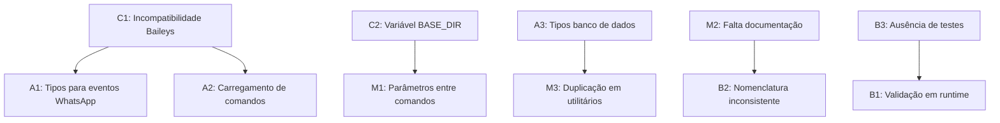

# Principais Problemas no Projeto

## Introdução

Este documento cataloga os principais problemas identificados durante o processo de migração para TypeScript. Cada problema é classificado por nível de severidade, categoria e prioridade de resolução. O objetivo é manter um registro centralizado de questões a serem abordadas, facilitando seu acompanhamento e resolução.

## Classificação dos Problemas

### Por Nível de Severidade

- **Crítico**: Impede o funcionamento do sistema ou da migração
- **Alto**: Afeta funcionalidades importantes, mas sem impedir o funcionamento geral
- **Médio**: Afeta funcionalidades secundárias ou causa inconveniências
- **Baixo**: Questões menores, como melhorias ou otimizações sugeridas

### Por Categoria

- **Tipagem**: Problemas relacionados à definição e implementação de tipos
- **Compatibilidade**: Problemas de compatibilidade com a versão original
- **Dependências**: Questões relacionadas a bibliotecas e dependências externas
- **Arquitetura**: Problemas na estrutura e design do código
- **Documentação**: Problemas na documentação do código e projeto
- **Testes**: Questões relacionadas a testes e validação
- **Desempenho**: Problemas que afetam a performance do sistema

## Problemas Identificados

### Problemas Críticos

| ID | Problema | Categoria | Prioridade | Impacto | Status | Solução Proposta |
|----|----------|-----------|------------|---------|--------|------------------|
| C1 | Incompatibilidade de tipos na biblioteca Baileys | Tipagem/Dependências | Alta | Impede a migração do módulo de conexão | Identificado | Criar tipos personalizados para a biblioteca Baileys ou buscar @types existentes |
| C2 | Variável global BASE_DIR não tipada adequadamente | Tipagem | Alta | Afeta todos os módulos que dependem desta variável | Identificado | Criar declaração global no arquivo types/global.d.ts |

### Problemas de Alto Nível

| ID | Problema | Categoria | Prioridade | Impacto | Status | Solução Proposta |
|----|----------|-----------|------------|---------|--------|------------------|
| A1 | Falta de tipos para retornos de eventos do WhatsApp | Tipagem | Alta | Dificulta a migração segura dos handlers de eventos | Identificado | Criar interfaces adequadas baseadas na documentação do Baileys |
| A2 | Incompatibilidade em funções dinâmicas de carregamento de comandos | Compatibilidade | Alta | Pode causar falha no carregamento de comandos | Identificado | Refatorar para suportar tipagem sem alterar comportamento |
| A3 | Falta de tipos para o sistema de banco de dados | Tipagem | Média | Afeta as operações de leitura e escrita no banco | Identificado | Criar interfaces para as estruturas do banco de dados |

### Problemas de Nível Médio

| ID | Problema | Categoria | Prioridade | Impacto | Status | Solução Proposta |
|----|----------|-----------|------------|---------|--------|------------------|
| M1 | Inconsistência na passagem de parâmetros entre comandos | Compatibilidade | Média | Pode causar comportamentos inesperados em alguns comandos | Identificado | Normalizar parâmetros com interfaces consistentes |
| M2 | Falta de documentação nos tipos criados | Documentação | Baixa | Dificulta manutenção futura do código | Identificado | Adicionar comentários JSDoc/TSDoc a todas as interfaces |
| M3 | Duplicação de código em funções de utilidade | Arquitetura | Média | Reduz a manutenibilidade do código | Identificado | Refatorar utilitários para melhor reutilização com typagem adequada |

### Problemas de Baixo Nível

| ID | Problema | Categoria | Prioridade | Impacto | Status | Solução Proposta |
|----|----------|-----------|------------|---------|--------|------------------|
| B1 | Falta de validação de tipos em runtime | Tipagem | Baixa | Pode causar erros em tempo de execução | Identificado | Adicionar validações em funções críticas |
| B2 | Nomenclatura inconsistente em alguns módulos | Arquitetura | Baixa | Dificulta a compreensão do código | Identificado | Padronizar nomenclatura durante a migração |
| B3 | Ausência de testes automatizados | Testes | Média | Dificulta garantir que a migração mantém o comportamento original | Identificado | Implementar testes básicos para funcionalidades críticas |

## Dependências entre Problemas

## Impacto no Cronograma

| Problema | Impacto no Cronograma | Justificativa |
|----------|------------------------|---------------|
| C1 | +3 dias | Requer análise detalhada da biblioteca e criação de tipos complexos |
| C2 | +1 dia | Necessita refatoração do sistema de paths global |
| A1 | +2 dias | Exige compreensão detalhada dos eventos do WhatsApp |
| A2 | +2 dias | Trabalho detalhado para manter compatibilidade |
| A3 | +1 dia | Estruturas de dados relativamente simples |
| M1-M3 | +3 dias | Trabalho incremental durante a migração |
| B1-B3 | +2 dias | Podem ser tratados em paralelo com outras tarefas |

## Próximas Ações

1. Priorizar resolução de C1 e C2 para permitir avanço nos componentes principais
2. Investigar disponibilidade de @types para Baileys ou alternativas
3. Criar estrutura básica de tipos globais antes de avançar na migração de arquivos
4. Desenvolver estratégia de teste para validar compatibilidade durante a migração

## Atualização e Revisão

Este documento será atualizado regularmente conforme novos problemas forem identificados ou os existentes forem resolvidos. A revisão completa será feita semanalmente durante o período de migração. 