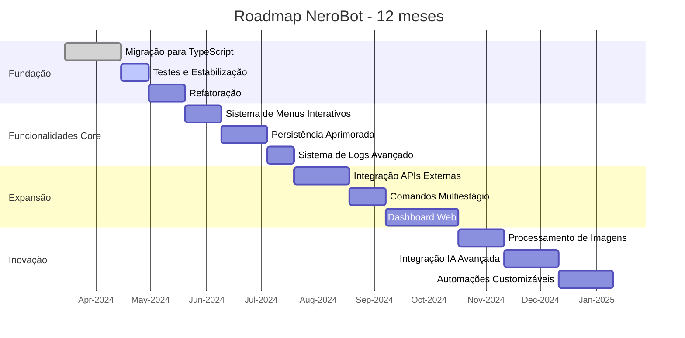

# Roadmap do Projeto NeroBot

## Visão de Longo Prazo

Este documento apresenta um roteiro de longo prazo para o projeto NeroBot após a migração para TypeScript, definindo a direção estratégica e as principais metas de desenvolvimento para os próximos 12 meses.

## Fases de Desenvolvimento

## Objetivos Estratégicos

### Q2 2024: Fortalecer a Base
- **Objetivo Principal**: ✅ Concluir a migração para TypeScript e estabilizar a aplicação
- **Metas**:
  - ✅ Completar a migração de todos os componentes para TypeScript
  - Criar suíte de testes automatizados com cobertura mínima de 60%
  - Refatorar partes críticas do código para aproveitar recursos do TypeScript
  - Melhorar documentação técnica e para usuários
  - Implementar as primeiras funcionalidades otimizadas pela migração

### Q3 2024: Expandir Funcionalidades Core
- **Objetivo Principal**: Melhorar a experiência do usuário e recursos fundamentais
- **Metas**:
  - Implementar sistema de menus interativos usando recursos nativos do WhatsApp
  - Desenvolver sistema de persistência de dados mais robusto e tipado
  - Criar sistema de logs avançado com níveis e persistência
  - Melhorar gerenciamento de grupos com recursos administrativos avançados
  - Otimizar performance e uso de recursos

### Q4 2024: Expandir Integrações
- **Objetivo Principal**: Ampliar as capacidades do bot através de integrações
- **Metas**:
  - Desenvolver framework para integração fácil com APIs externas
  - Implementar sistema de comandos multiestágio
  - Criar sistema de agendamento de tarefas
  - Iniciar desenvolvimento de dashboard web para administração
  - Adicionar suporte a plugins de terceiros

### Q1 2025: Inovação e Diferenciação
- **Objetivo Principal**: Adicionar funcionalidades inovadoras que diferenciem o bot
- **Metas**:
  - Finalizar dashboard web para administração completa
  - Implementar processamento de imagens avançado
  - Integrar capacidades de IA mais sofisticadas
  - Desenvolver sistema de automações customizáveis pelo usuário
  - Expandir suporte a múltiplos idiomas

## Detalhamento das Principais Iniciativas

### Sistema de Menus Interativos
**Descrição**: Menus de navegação utilizando recursos nativos de botões e listas do WhatsApp para melhorar a experiência do usuário.

**Componentes-chave**:
- Biblioteca de componentes de UI para criação de menus
- Sistema de gerenciamento de estados para navegação
- API tipada para criação de menus personalizados
- Timeout e gestão de sessões de menu

**Indicadores de Sucesso**:
- Redução de 50% em erros de usuário na execução de comandos
- Feedback positivo dos usuários sobre usabilidade
- Adoção em pelo menos 70% dos comandos complexos

### Dashboard Web
**Descrição**: Interface web para administração e monitoramento do bot, permitindo configuração sem necessidade de comandos no WhatsApp.

**Componentes-chave**:
- Backend API RESTful com autenticação segura
- Frontend responsivo com visualização em tempo real
- Painel de controle para administradores
- Visualização de estatísticas e logs
- Configuração visual de comandos e recursos

**Indicadores de Sucesso**:
- Redução de 70% no tempo de configuração do bot
- Capacidade de administrar múltiplas instâncias
- Feedback positivo sobre facilidade de uso

### Integração com IA Avançada
**Descrição**: Aprimorar as capacidades de IA do bot para fornecer respostas mais naturais e úteis em diversos contextos.

**Componentes-chave**:
- Integração com modelos de linguagem avançados
- Sistema de contexto para manter conversas coerentes
- Personalização de respostas baseadas em perfil de usuário
- Técnicas para redução de custos de API de IA
- Fallbacks para funcionar offline quando necessário

**Indicadores de Sucesso**:
- Aumento na taxa de satisfação com respostas
- Maior engajamento em conversas com o bot
- Capacidade de entender e responder a perguntas complexas

## Marcos Importantes

| Macro | Prazo | Descrição | Status | Dependências |
|-------|-------|-----------|--------|--------------|
| Versão 3.0 | Junho 2024 | Lançamento da versão TypeScript estabilizada | Em andamento | ✅ Migração concluída |
| Versão 3.5 | Setembro 2024 | Lançamento com menus interativos e persistência melhorada | Não iniciado | Implementação de menus e banco de dados |
| Versão 4.0 | Dezembro 2024 | Lançamento com integração de APIs e dashboard beta | Não iniciado | Framework de APIs e primeiras telas do dashboard |
| Versão 4.5 | Março 2025 | Lançamento com recursos avançados de IA e automação | Não iniciado | Integração com IA e sistema de automação |

## Estratégia de Crescimento

### Comunidade
- Criar documentação detalhada para desenvolvedores
- Estabelecer canal de comunicação para sugestões e feedback
- Implementar sistema de contribuição para plugins da comunidade
- Realizar eventos e webinars para demonstrar funcionalidades

### Adoção
- Simplificar processo de instalação e configuração
- Criar tutoriais em vídeo para novos usuários
- Desenvolver casos de uso de exemplo para diferentes cenários
- Implementar sistema de telemetria opt-in para entender uso

## Considerações Técnicas

### Escalabilidade
- Implementar arquitetura modular para permitir expansão
- Otimizar uso de memória e CPU para suportar grupos grandes
- Desenvolver sistema de cache inteligente para operações frequentes
- Preparar para suporte a múltiplas instâncias

### Manutenibilidade
- Manter cobertura de testes acima de 70%
- Revisar e melhorar documentação continuamente
- Aderir a padrões consistentes de código
- Revisar dependências regularmente para segurança

### Compatibilidade
- Garantir compatibilidade com versões mais recentes do WhatsApp
- Adaptar-se a mudanças na API do WhatsApp rapidamente
- Manter suporte a diferentes plataformas (Android, iOS, Web)
- Implementar testes de compatibilidade automatizados

## Monitoramento e Ajustes

Este roadmap será revisado trimestralmente para garantir alinhamento com:
- Mudanças tecnológicas no ecossistema WhatsApp
- Feedback dos usuários e necessidades emergentes
- Progresso real vs. planejado
- Novas oportunidades e desafios identificados

As datas e escopos podem ser ajustados conforme necessário, mantendo a transparência com a comunidade de usuários sobre quaisquer mudanças significativas no plano. 