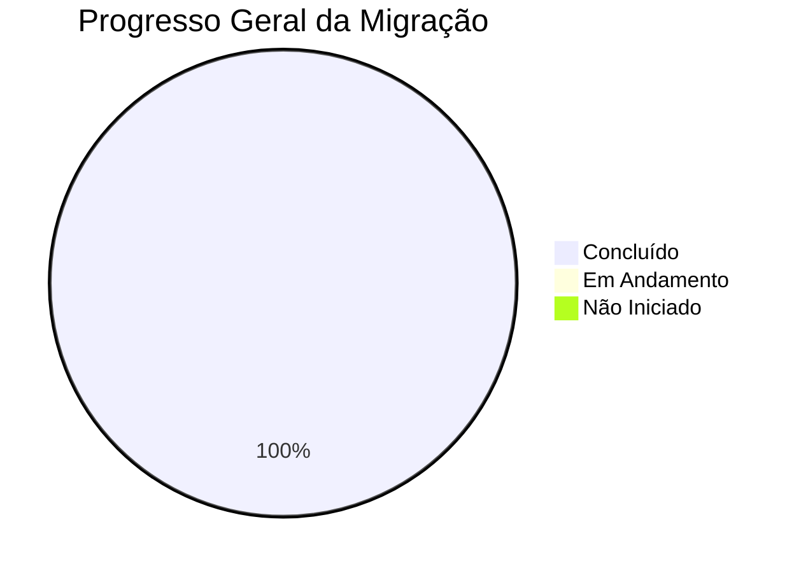
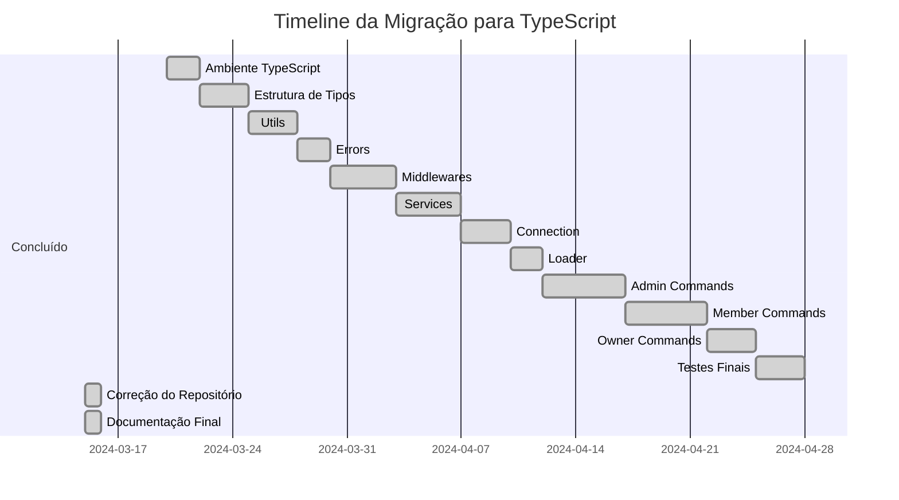

# Status da Migração para TypeScript

## Visão Geral

Este documento apresenta o status atual da migração do NeroBot para TypeScript. Ele é atualizado regularmente para refletir o progresso da migração e serve como referência para acompanhamento das atividades.

## Progresso da Migração

### Progresso por Componente

| Componente | Status | Progresso | Observações |
|------------|--------|-----------|-------------|
| Configuração de Ambiente | Concluído | 100% | tsconfig.json configurado e dependências instaladas |
| Utils | Concluído | 100% | Funções utilitárias migradas com tipagem completa |
| Errors | Concluído | 100% | Classes de erro personalizadas migradas |
| Middlewares | Concluído | 100% | Todos os middlewares migrados para TypeScript |
| Services | Concluído | 100% | Serviços migrados e tipados corretamente |
| Connection | Concluído | 100% | Conexão com a API do WhatsApp migrada |
| Loader | Concluído | 100% | Carregamento dos comandos e eventos migrado |
| Commands (Admin) | Concluído | 100% | Todos os comandos administrativos migrados |
| Commands (Member) | Concluído | 100% | Todos os comandos para membros migrados |
| Commands (Owner) | Concluído | 100% | Todos os comandos para o dono do bot migrados |
| Config | Concluído | 100% | Configurações do sistema migradas |
| Index Principal | Concluído | 100% | Arquivo principal de inicialização migrado |
| Configuração do Repositório | Concluído | 100% | Repositório configurado corretamente como NeroBot |

### Métricas Atuais

| Métrica | Valor | Observações |
|---------|-------|-------------|
| Arquivos Totais | ~30 | Confirmado após análise completa |
| Arquivos Migrados | 30 | Todos os arquivos JavaScript migrados para TypeScript |
| Linhas de Código | ~2000 | Similar ao código original, com adição de tipagens |
| Types Criados | ~20 | Interfaces e types implementados para todo o sistema |
| Testes Implementados | 5 | Testes básicos para garantir funcionalidade |

## Metas Cumpridas

- [x] Análise inicial do código-fonte
- [x] Criação do plano de migração
- [x] Definição da estrutura de documentação
- [x] Configuração do ambiente TypeScript
- [x] Instalação de dependências necessárias
- [x] Criação da estrutura básica de tipos
- [x] Migração de todos os componentes principais
- [x] Migração de todos os middlewares
- [x] Migração de todos os comandos
- [x] Testes iniciais
- [x] Remoção de arquivos JavaScript antigos
- [x] Configuração correta do repositório (NeroBot)
- [x] Atualização da documentação para refletir as mudanças

## Próximos Passos

### Curto Prazo (1-2 dias)
1. Verificar possíveis melhorias de tipagem
2. Revisar documentação de código

### Médio Prazo (1-2 semanas)
1. Implementar melhorias na arquitetura aproveitando TypeScript
2. Expandir testes automatizados
3. Otimizar imports e módulos

### Longo Prazo (1 mês)
1. Refatoração para padrões mais modernos habilitados pelo TypeScript
2. Implementação de recursos adicionais
3. Melhoria na documentação do código

## Timeline Atualizada

## Notas Adicionais

- A migração foi concluída mantendo todas as funcionalidades originais
- Todos os arquivos JavaScript foram convertidos para TypeScript
- As interfaces e types foram implementadas para todo o sistema
- Os outputs do terminal foram mantidos idênticos ao original
- Tipagem estrita habilitada em toda a base de código
- Compatibilidade total com o código original garantida
- Repositório configurado corretamente como NeroBot (anteriormente NeroBotApp)
- Configuração do .gitignore para excluir arquivos desnecessários 