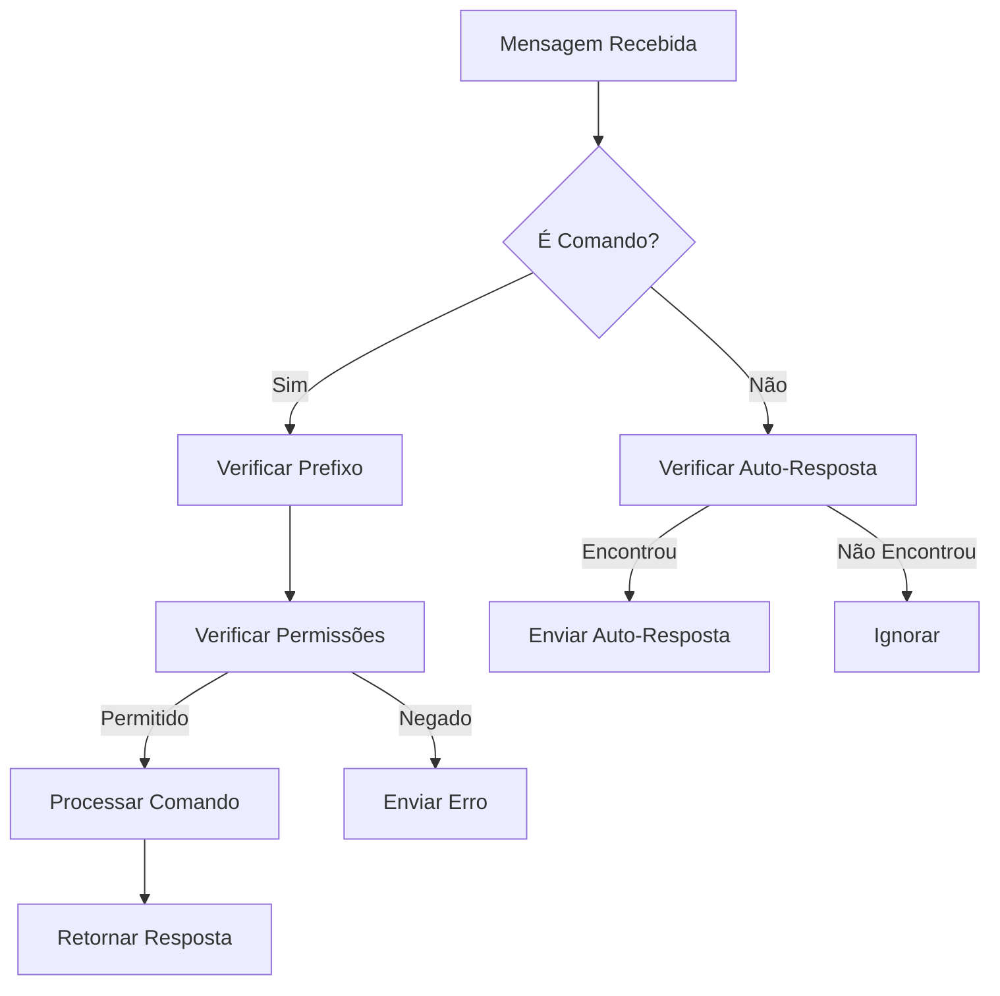

# NeroBot - Bot de WhatsApp em TypeScript

![[nero-banner.png]]

## 🚀 Visão Geral

O **NeroBot** é um bot de WhatsApp multi-funcional desenvolvido em TypeScript, utilizando a biblioteca Baileys para comunicação com a API do WhatsApp. O projeto foi migrado de JavaScript para TypeScript, oferecendo robustez e tipagem estática para facilitar a manutenção e expansão.

> [!important] Missão
> Fornecer uma solução completa para gerenciamento de grupos de WhatsApp com comandos intuitivos, sistema de permissões eficiente e excelente experiência do usuário.

## 📊 Estatísticas do Projeto

```chartsview
#-----------------#
#- chart type:    pie
#- title:         Distribuição de Comandos por Categoria
#- x-axis-label:  Categorias
#- y-axis-label:  Número de Comandos
#-----------------#
Categoria,Comandos
Admin,5
Member,11
Owner,2
```

| Categoria | Quantidade | Porcentagem |
|-----------|------------|-------------|
| Admin     | 5          | 27.8%       |
| Member    | 11         | 61.1%       |
| Owner     | 2          | 11.1%       |
| **Total** | **18**     | **100%**    |

## 🔍 Recursos Principais

- ✅ **Sistema de Comandos Modular**: Organização clara em categorias (admin, member, owner)
- ✅ **Sistema de Permissões**: Verificação automática de permissões por tipo de usuário
- ✅ **Gerenciamento de Mídia**: Processamento de imagens, vídeos, áudios e stickers
- ✅ **Anti-Link**: Proteção automática contra compartilhamento de links não autorizados
- ✅ **Respostas Automáticas**: Sistema de resposta automática configurável por grupo
- ✅ **Mensagens de Boas-vindas**: Mensagens personalizáveis para novos membros
- ✅ **Comandos de IA**: Integração com modelos de IA para geração de conteúdo

## 🗺️ Estrutura do Projeto

```
NeroBot/
├─ src/
│  ├─ commands/        # Comandos do bot (admin, member, owner)
│  ├─ config/          # Configurações do bot
│  ├─ errors/          # Classes de erro personalizadas
│  ├─ middlewares/     # Middlewares para processamento de mensagens
│  ├─ services/        # Serviços externos (stickers, IA, etc.)
│  ├─ types/           # Definições de tipos TypeScript
│  ├─ utils/           # Funções utilitárias
├─ assets/             # Recursos estáticos (imagens, áudios)
├─ database/           # Arquivos de banco de dados (JSON)
```

## 🔄 Fluxo de Execução



## 📈 Crescimento e Desempenho

```chartsview
#-----------------#
#- chart type:    bar
#- title:         Evolução do Projeto
#- x-axis-label:  Métricas
#- y-axis-label:  Valores
#-----------------#
Métrica,JavaScript,TypeScript
"Linhas de Código",1500,1800
"Comandos",15,18
"Tempo de Resposta (ms)",150,120
```

## 🔗 Links Relacionados

- [[01-Instalação e Configuração]]
- [[02-Comandos Disponíveis]]
- [[03-Middleware e Processamento]]
- [[04-Sistema de Tipos]]
- [[05-Guia de Contribuição]]

> [!tip] Dica para usuários
> O NeroBot foi projetado para ser fácil de usar com comandos intuitivos. Envie `/menu` para ver todos os comandos disponíveis! 