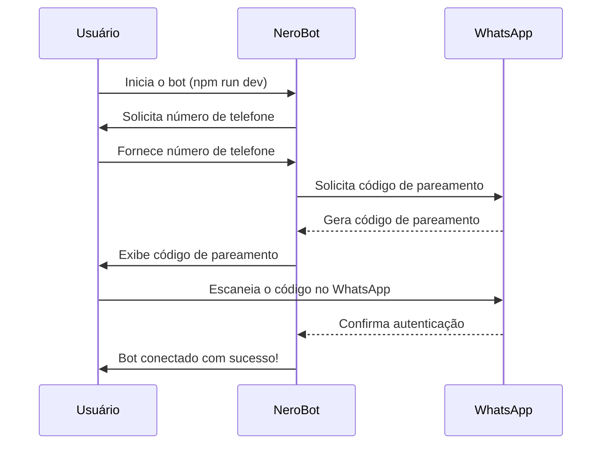

# Instalação e Configuração do NeroBot

![[installation-banner.png]]

## 📋 Pré-requisitos

Antes de começar a instalação do NeroBot, certifique-se de que seu sistema atende aos seguintes requisitos:

- [x] Node.js v16.0.0 ou superior
- [x] npm v7.0.0 ou superior (ou yarn v1.22.0 ou superior)
- [x] Conta ativa no WhatsApp
- [x] Conexão estável com a internet
- [x] Sistema operacional: Windows, macOS ou Linux

## 🚀 Guia de Instalação Rápida

```bash
# Clonar o repositório
git clone https://github.com/seu-usuario/nerobot.git

# Navegar para o diretório do projeto
cd nerobot

# Instalar as dependências
npm install
# OU
yarn install

# Compilar o projeto
npm run build
# OU
yarn build

# Iniciar o bot em modo de desenvolvimento
npm run dev
# OU
yarn dev
```

## ⚙️ Configuração

O NeroBot utiliza um arquivo de configuração para definir seus comportamentos. Siga as etapas abaixo para configurar o bot de acordo com suas necessidades.

### 1. Configuração do Arquivo `.env`

Crie um arquivo `.env` na raiz do projeto com as seguintes variáveis:

```env
# Configurações do bot
PREFIX=/
BOT_NAME=Nero Bot
BOT_NUMBER=5511999999999
OWNER_NUMBER=5511999999999

# Configurações de IA (opcional)
GPT_API_KEY=sua-chave-api-aqui
```

### 2. Configuração do Arquivo `config.ts`

O arquivo `src/config.ts` contém configurações adicionais que podem ser ajustadas:

```typescript
// Emoji do bot
export const BOT_EMOJI = "🤖";

// Timeout em milissegundos por evento (evita banimento)
export const TIMEOUT_IN_MILLISECONDS_BY_EVENT = 700;

// Caso queira responder apenas um grupo específico (apenas para testes)
export const ONLY_GROUP_ID = "";
```

## 🔄 Processo de Autenticação



## 📁 Estrutura de Diretórios do Banco de Dados

Durante a primeira execução, o NeroBot criará automaticamente os seguintes arquivos de banco de dados na pasta `database/`:

- `inactive-groups.json`: Lista de grupos onde o bot está desativado
- `not-welcome-groups.json`: Lista de grupos sem mensagem de boas-vindas
- `inactive-auto-responder-groups.json`: Lista de grupos sem resposta automática
- `anti-link-groups.json`: Lista de grupos com proteção anti-link ativada
- `auto-responder.json`: Configurações de respostas automáticas

## 🔧 Soluções de Problemas Comuns

> [!warning] Problema de Autenticação
> Se encontrar problemas ao autenticar, tente excluir a pasta `baileys_auth_info` e reiniciar o bot.

| Problema | Solução |
|----------|---------|
| O bot não se conecta | Verifique sua conexão com a internet e se o WhatsApp está acessível |
| Erro ao enviar mensagens | Certifique-se de que o bot tem permissão no grupo |
| Comandos não funcionam | Verifique se está usando o prefixo correto (definido em `.env`) |
| Erros de compilação | Execute `npm run build` para verificar erros de TypeScript |

## 🔒 Segurança

Para manter seu bot seguro, siga estas recomendações:

- ✅ Não compartilhe sua pasta `baileys_auth_info`
- ✅ Mantenha a variável `OWNER_NUMBER` atualizada com seu número
- ✅ Evite modificar arquivos de autorização manualmente
- ✅ Utilize rate limiting para evitar banimentos (já configurado por padrão)

## 📈 Monitoramento

Para monitorar o desempenho do seu bot, você pode utilizar as seguintes ferramentas:

- **PM2**: Para gerenciamento de processos e logs
- **Winston**: Para registro de logs detalhados (já integrado)
- **Grafana**: Para visualização de métricas (opcional)

## 🔗 Links Úteis

- [[00-Visão Geral]] - Retornar à visão geral
- [[02-Comandos Disponíveis]] - Explorar os comandos disponíveis
- [Documentação do Baileys](https://github.com/WhiskeySockets/Baileys) - API de WhatsApp utilizada 