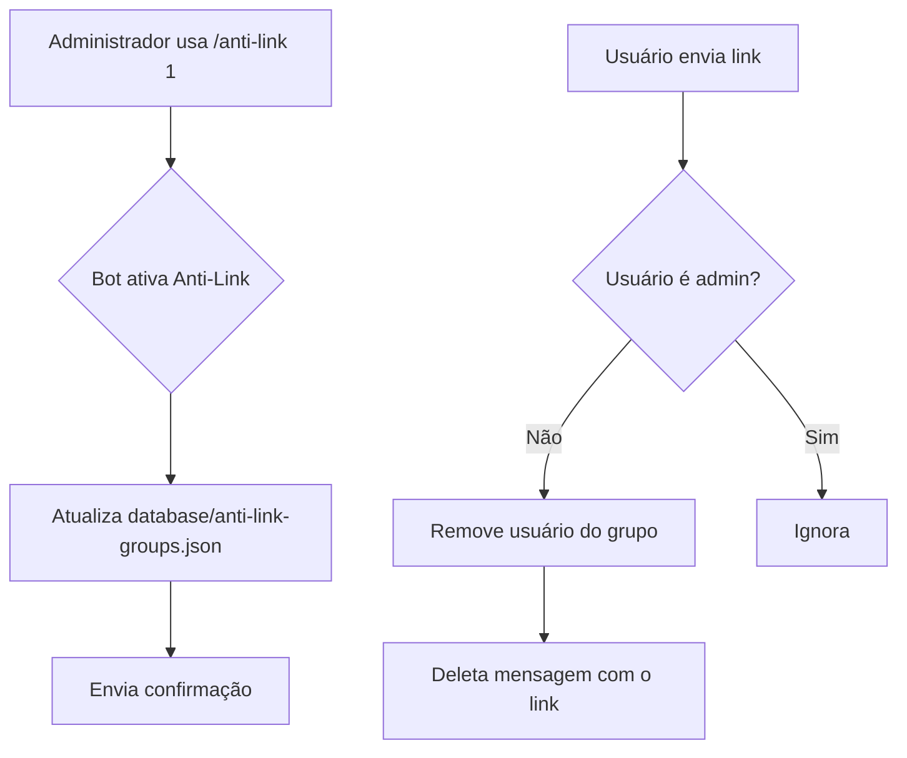
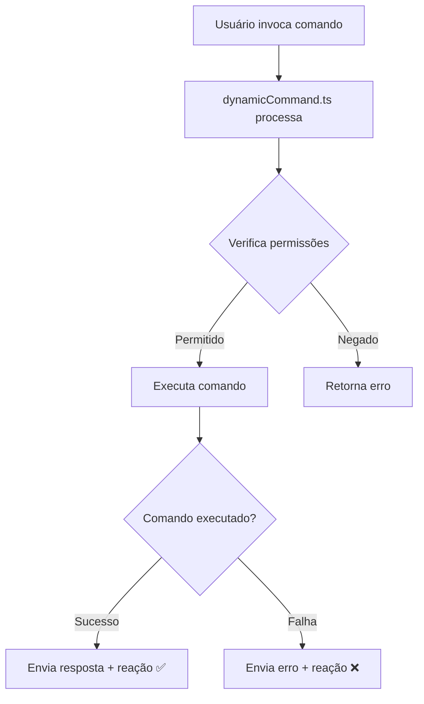

# Comandos Disponíveis no NeroBot

![[commands-banner.png]]

## 📊 Visão Geral dos Comandos

O NeroBot possui um total de **18 comandos** divididos em três categorias principais:

```chartsview
#-----------------#
#- chart type:    pie
#- title:         Comandos por Categoria
#- x-axis-label:  Categorias
#- y-axis-label:  Quantidade
#-----------------#
Categoria,Quantidade
Admin,5
Member,11
Owner,2
```

## 🛡️ Comandos de Admin

Estes comandos são exclusivos para administradores de grupo.

| Comando | Descrição | Uso | Parâmetros |
|---------|-----------|-----|------------|
| `/anti-link` | Ativa ou desativa a proteção contra links | `/anti-link 1` ou `/anti-link 0` | `1` (ativar) ou `0` (desativar) |
| `/auto-responder` | Ativa ou desativa respostas automáticas | `/auto-responder 1` ou `/auto-responder 0` | `1` (ativar) ou `0` (desativar) |
| `/ban` | Remove um usuário do grupo | `/ban @usuário` ou responder com `/ban` | Menção ao usuário (opcional) |
| `/hidetag` | Menciona todos os membros com mensagem oculta | `/hidetag mensagem` | Texto a ser enviado |
| `/welcome` | Ativa ou desativa mensagens de boas-vindas | `/welcome 1` ou `/welcome 0` | `1` (ativar) ou `0` (desativar) |

### Exemplo de Uso do Comando Anti-Link

> [!example] Ativando Anti-Link
> 1. Administrador: `/anti-link 1`
> 2. NeroBot: "Anti-link ativado neste grupo! ✅"
> 3. Se um usuário enviar um link: "Anti-link ativado! Você foi removido por enviar um link!"



## 👤 Comandos de Membro

Estes comandos podem ser usados por qualquer membro do grupo.

| Comando | Descrição | Uso | Parâmetros |
|---------|-----------|-----|------------|
| `/attp` | Cria um sticker animado com texto | `/attp texto` | Texto para o sticker |
| `/cep` | Consulta informações de um CEP | `/cep 12345678` | Número do CEP |
| `/gpt` | Faz uma pergunta ao GPT | `/gpt pergunta` | Pergunta para o modelo |
| `/ia-sticker` | Cria um sticker usando IA | `/ia-sticker tema` | Tema para o sticker |
| `/image` | Gera uma imagem com IA | `/image descrição` | Descrição da imagem |
| `/menu` | Exibe o menu de comandos | `/menu` | Nenhum |
| `/ping` | Verifica se o bot está online | `/ping` | Nenhum |
| `/play-audio` | Baixa e envia um áudio do YouTube | `/play-audio nome da música` | Nome da música |
| `/play-video` | Baixa e envia um vídeo do YouTube | `/play-video nome do vídeo` | Nome do vídeo |
| `/sticker` | Cria um sticker a partir de uma imagem | `/sticker` (em resposta a uma imagem) | Imagem (como anexo ou resposta) |
| `/to-image` | Converte um sticker em imagem | `/to-image` (em resposta a um sticker) | Sticker (como resposta) |

### Estatísticas de Uso dos Comandos

```chartsview
#-----------------#
#- chart type:    bar
#- title:         Comandos Mais Utilizados
#- x-axis-label:  Comandos
#- y-axis-label:  Frequência de Uso (%)
#-----------------#
Comando,Uso
"menu",22
"sticker",18
"ping",15
"gpt",12
"play-audio",10
"image",8
"cep",5
"outros",10
```

## 👑 Comandos de Owner

Estes comandos são exclusivos para o dono do bot.

| Comando | Descrição | Uso | Parâmetros |
|---------|-----------|-----|------------|
| `/off` | Desativa o bot em um grupo | `/off` | Nenhum |
| `/on` | Ativa o bot em um grupo | `/on` | Nenhum |

## 🔧 Detalhes Técnicos

### Estrutura de um Comando

Cada comando no NeroBot segue uma estrutura padrão que facilita a manutenção e expansão:

```typescript
import { PREFIX } from "../../config";
import { CommandHandlerParams } from "../../types/commands";

export const name = "nome-do-comando";
export const description = "Descrição do comando";
export const commands = ["comando", "alias"];
export const usage = `${PREFIX}comando [parâmetros]`;

export const handle = async ({ 
  args, 
  sendReply, 
  sendReact 
}: CommandHandlerParams): Promise<void> => {
  // Implementação do comando
  await sendReact("✅");
  await sendReply("Comando executado com sucesso!");
};
```

### Sistema de Callback

Os comandos utilizam um sistema de callbacks para garantir consistência nas respostas:



## 🚀 Como Adicionar Novos Comandos

Para adicionar um novo comando ao NeroBot, siga estas etapas:

1. Crie um novo arquivo na pasta apropriada (`src/commands/admin`, `src/commands/member` ou `src/commands/owner`)
2. Implemente o comando seguindo a estrutura padrão
3. Exporte as constantes necessárias: `name`, `description`, `commands`, `usage` e `handle`
4. Compile o projeto com `npm run build`

> [!tip] Dica para Desenvolvedores
> Você pode usar o arquivo `src/commands/🤖-como-criar-comandos.ts` como referência para criar novos comandos.

## 🔗 Links Relacionados

- [[00-Visão Geral]] - Retornar à visão geral
- [[01-Instalação e Configuração]] - Guia de instalação
- [[03-Middleware e Processamento]] - Entender o processamento de comandos 