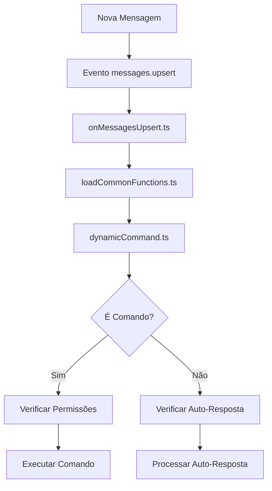
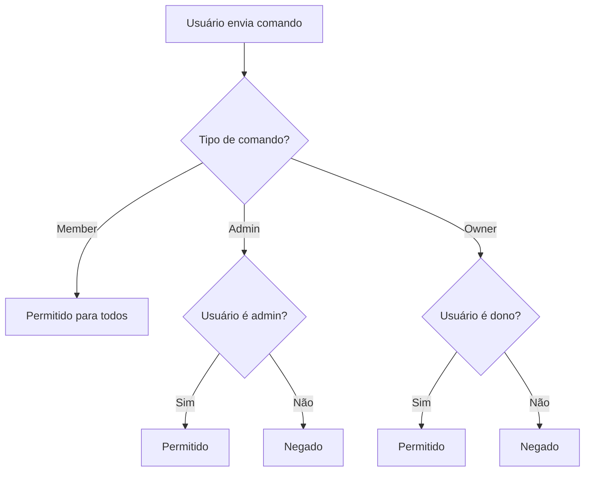
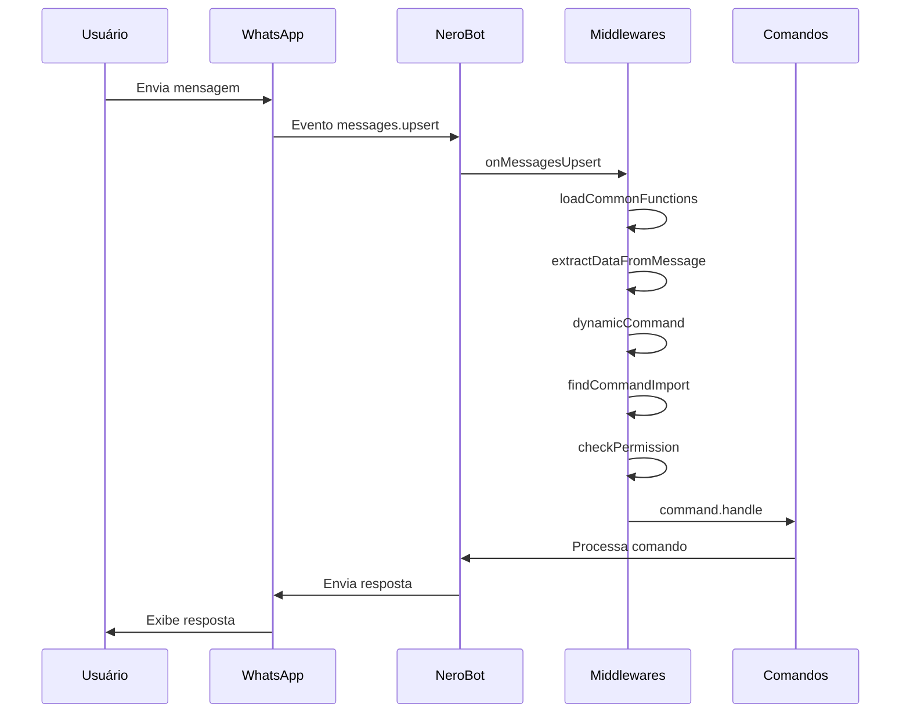
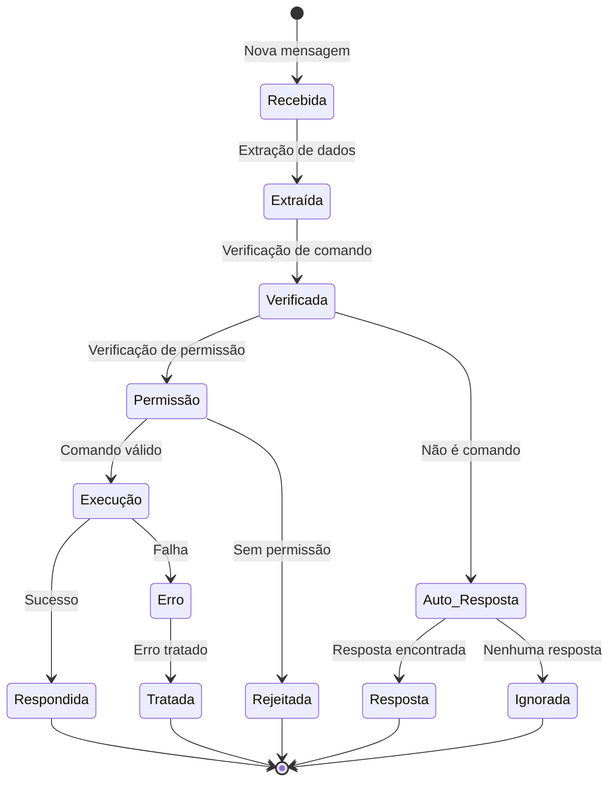

# Middleware e Processamento de Mensagens

![[middleware-banner.png]]

## 🔄 Visão Geral do Sistema de Processamento

O NeroBot utiliza um sistema sofisticado de middleware para processar mensagens e comandos. Este sistema é responsável por interceptar, verificar, e encaminhar mensagens para os manipuladores apropriados.



## ⚙️ Componentes Principais

### 1. Loader (src/loader.ts)

O loader é responsável por registrar os eventos que serão escutados pelo socket do WhatsApp:

```typescript
export const load = (socket: WaBotClient): void => {
  (global as any).BASE_DIR = path.resolve(__dirname);

  socket.ev.on("messages.upsert", async ({ messages }) => {
    setTimeout(() => {
      onMessagesUpsert({ socket, messages });
    }, TIMEOUT_IN_MILLISECONDS_BY_EVENT);
  });

  socket.ev.on("group-participants.update", async (data) => {
    setTimeout(() => {
      try {
        onGroupParticipantsUpdate({ socket, groupParticipantsUpdate: data });
      } catch (error) {
        console.error(error);
      }
    }, TIMEOUT_IN_MILLISECONDS_BY_EVENT);
  });
};
```

> [!note] Observação
> O TIMEOUT_IN_MILLISECONDS_BY_EVENT é utilizado para evitar o banimento do WhatsApp devido a muitas requisições em um curto período.

### 2. Middleware de Mensagens (src/middlewares/onMessagesUpsert.ts)

Este middleware é acionado sempre que uma nova mensagem é recebida:

```typescript
export const onMessagesUpsert = async ({ 
  socket, 
  messages 
}: MessagesUpsertParams): Promise<void> => {
  if (!messages.length) {
    return;
  }

  for (const webMessage of messages) {
    const commonFunctions = loadCommonFunctions({ socket, webMessage });

    if (!commonFunctions) {
      continue;
    }

    await dynamicCommand(commonFunctions);
  }
};
```

### 3. Funções Comuns (src/utils/loadCommonFunctions.ts)

Este componente carrega funções úteis para o processamento de mensagens:

```typescript
export const loadCommonFunctions = ({ 
  socket, 
  webMessage 
}: LoadCommonFunctionsParams): CommonFunctions | null => {
  // Extrai dados da mensagem
  const extractedData = extractDataFromMessage(webMessage);
  
  // Verificações iniciais
  if (!extractedData.remoteJid || isJidUser(extractedData.remoteJid)) {
    return null;
  }

  // Carrega funções úteis
  const sendReply = async (text: string) => { ... };
  const sendReact = async (emoji: string) => { ... };
  // ... outras funções
  
  return {
    ...extractedData,
    socket,
    webMessage,
    sendReply,
    sendReact,
    // ... outras funções
  };
};
```

### 4. Processador de Comandos (src/utils/dynamicCommand.ts)

O processador de comandos é o componente central que:

1. Verifica se a mensagem é um comando
2. Verifica permissões do usuário
3. Executa o comando apropriado
4. Trata erros e envia respostas

```typescript
export const dynamicCommand = async (paramsHandler: CommonFunctions): Promise<void> => {
  // Extrai os parâmetros necessários
  const { commandName, prefix, remoteJid /* ... outros */ } = paramsHandler;

  // Verifica anti-link
  if (isActiveAntiLinkGroup(remoteJid) && isLink(fullMessage)) {
    // Processa violação de anti-link
  }

  // Busca o comando
  const { type, command } = findCommandImport(commandName);

  // Verifica se o grupo é restrito
  if (ONLY_GROUP_ID && ONLY_GROUP_ID !== remoteJid) {
    return;
  }

  // Verifica prefixo e comando
  if (!verifyPrefix(prefix) || !hasTypeOrCommand({ type, command })) {
    // Verifica auto-responder
    if (isActiveAutoResponderGroup(remoteJid)) {
      const response = getAutoResponderResponse(fullMessage);
      if (response) {
        await sendReply(response);
      }
    }
    return;
  }

  // Verifica permissões
  if (!(await checkPermission({ type, ...paramsHandler }))) {
    await sendErrorReply("Você não tem permissão para executar este comando!");
    return;
  }

  // Verifica se o grupo está ativo
  if (!isActiveGroup(remoteJid) && command.name !== "on") {
    await sendWarningReply(
      "Este grupo está desativado! Peça para o dono do grupo ativar o bot!"
    );
    return;
  }

  // Executa o comando
  try {
    await command.handle({
      ...paramsHandler,
      type,
    });
  } catch (error) {
    // Tratamento de erros específicos
    if (error instanceof InvalidParameterError) {
      await sendWarningReply(`Parâmetros inválidos! ${error.message}`);
    } else if (error instanceof WarningError) {
      await sendWarningReply(error.message);
    } else if (error instanceof DangerError) {
      await sendErrorReply(error.message);
    } else {
      // Erro desconhecido
      errorLog("Erro ao executar comando", error);
      await sendErrorReply(
        `Ocorreu um erro ao executar o comando ${command.name}! O desenvolvedor foi notificado!\n\n📄 *Detalhes*: ${error.message}`
      );
    }
  }
};
```

## 🛡️ Sistema de Permissões

O NeroBot implementa um sistema de permissões que verifica se um usuário tem permissão para executar determinados comandos:

```typescript
export const checkPermission = async ({
  type,
  remoteJid,
  userJid,
  socket,
}: CheckPermissionParams): Promise<boolean> => {
  if (!type || !remoteJid || !userJid) {
    return false;
  }

  if (type === "owner") {
    return await isOwner({ remoteJid, userJid, socket });
  }

  if (type === "admin") {
    return await isAdmin({ remoteJid, userJid, socket });
  }

  return true;
};
```

### Hierarquia de Permissões



## 📡 Processamento de Eventos do Grupo

O NeroBot também processa eventos de grupo, como entrada e saída de participantes:

```typescript
export const onGroupParticipantsUpdate = async ({
  socket,
  groupParticipantsUpdate,
}: GroupParticipantsUpdateParams): Promise<void> => {
  const { id, participants, action } = groupParticipantsUpdate;

  // Verifica se o grupo tem mensagens de boas-vindas ativadas
  if (!isActiveWelcomeGroup(id)) {
    return;
  }

  // Processa a entrada de novos participantes
  if (action === "add") {
    for (const participant of participants) {
      await socket.sendMessage(id, {
        text: `Bem-vindo(a) ${participant.split("@")[0]} ao grupo! 🎉`,
      });
    }
  }

  // Outros tipos de eventos podem ser processados aqui
};
```

## 🔍 Diagrama de Sequência do Processamento



## 🧠 Lógica de Decisão

O sistema de middleware utiliza uma lógica de decisão em cascata:

1. **Verificação inicial**: A mensagem contém um comando válido?
2. **Verificação de permissão**: O usuário tem permissão para este comando?
3. **Verificação de grupo**: O grupo está ativo?
4. **Execução**: O comando é executado e a resposta é enviada
5. **Tratamento de erros**: Erros são capturados e mensagens apropriadas são enviadas

## 🔄 Ciclo de Vida de uma Mensagem



## 🔗 Links Relacionados

- [[00-Visão Geral]] - Retornar à visão geral
- [[02-Comandos Disponíveis]] - Explorar os comandos disponíveis
- [[04-Sistema de Tipos]] - Entender o sistema de tipos 