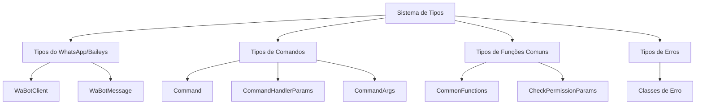
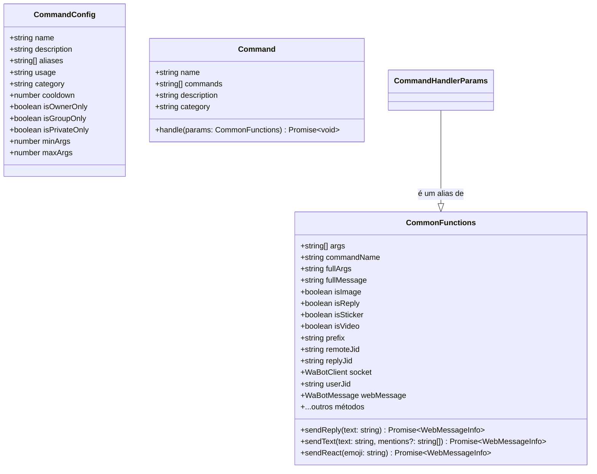
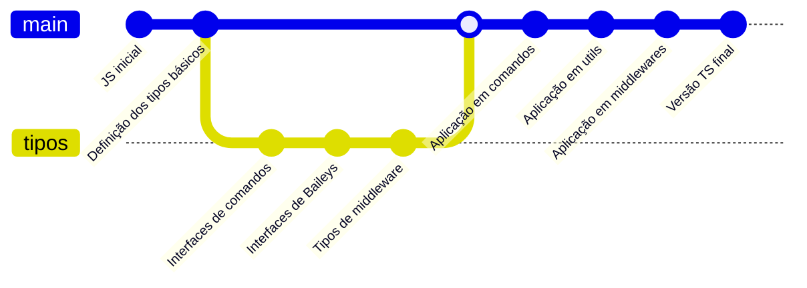

# Sistema de Tipos do NeroBot

![[types-banner.png]]

## 🧩 Visão Geral do Sistema de Tipos

O NeroBot utiliza TypeScript para fornecer tipagem estática ao código, aumentando a robustez e facilitando a manutenção. O sistema de tipos foi cuidadosamente projetado para representar as estruturas de dados utilizadas no bot, desde as mensagens do WhatsApp até os comandos e funções de utilidade.



## 📋 Principais Interfaces e Tipos

### Tipos de WhatsApp (src/types/baileys.d.ts)

Estas interfaces definem os tipos relacionados à API do WhatsApp:

```typescript
export interface WaBotClient extends ReturnType<typeof makeWASocket> {
  // Métodos adicionais específicos do NeroBot
  sendText: (jid: string, text: string, quoted?: any) => Promise<proto.WebMessageInfo>;
  reply: (jid: string, text: string, quoted: any) => Promise<proto.WebMessageInfo>;
  sendImage: (jid: string, url: string, caption?: string, quoted?: any) => Promise<proto.WebMessageInfo>;
  sendAudio: (jid: string, url: string, quoted?: any) => Promise<proto.WebMessageInfo>;
  sendVideo: (jid: string, url: string, caption?: string, quoted?: any) => Promise<proto.WebMessageInfo>;
  sendSticker: (jid: string, url: string, quoted?: any) => Promise<proto.WebMessageInfo>;
}

export type WaBotMessage = proto.IWebMessageInfo;

export interface BaileysError extends Error {
  output?: {
    statusCode?: number;
    payload?: any;
  };
}
```

> [!info] Extensão de Tipos do Baileys
> O NeroBot estende os tipos originais do Baileys para adicionar funcionalidades específicas, como métodos de envio de mensagens personalizados.

### Tipos de Comandos (src/types/commands.d.ts)

Estas interfaces definem a estrutura dos comandos no NeroBot:

```typescript
// Interface para os parâmetros dos manipuladores de comandos
export interface CommandArgs {
  client: WaBotClient;
  message: WaBotMessage;
  args: string[];
  prefix: string;
  command: string;
}

// Configuração dos comandos
export interface CommandConfig {
  name: string;
  description: string;
  aliases?: string[];
  usage?: string;
  category?: string;
  cooldown?: number;
  isOwnerOnly?: boolean;
  isGroupOnly?: boolean;
  isPrivateOnly?: boolean;
  minArgs?: number;
  maxArgs?: number;
}

// Interface de comando completa
export interface Command extends CommandConfig {
  execute: (args: CommandArgs) => Promise<any>;
}

// Interface para categorias de comandos
export interface CommandCategory {
  name: string;
  emoji: string;
  description: string;
}

// Interface para o gerenciador de comandos
export interface CommandManager {
  register: (command: Command) => void;
  get: (name: string) => Command | undefined;
  getAll: () => Map<string, Command>;
  getByCategory: (category: string) => Command[];
  getAllCategories: () => CommandCategory[];
  loadCommands: (directory: string) => Promise<void>;
}

// Interface para funções comuns utilizadas nos comandos
export interface CommonFunctions {
  args: string[];
  commandName: string | null;
  fullArgs: string | null;
  fullMessage: string | null;
  isImage: boolean;
  isReply: boolean;
  isSticker: boolean;
  isVideo: boolean;
  prefix: string | null;
  remoteJid: string | null;
  replyJid: string | null;
  socket: WaBotClient;
  userJid: string | null;
  webMessage: WaBotMessage;
  // ... diversos métodos para manipulação de mensagens
}

// Alias para manter compatibilidade com código existente
export type CommandHandlerParams = CommonFunctions;

// Interface de comando (formato novo)
export interface Command {
  name: string;
  commands: string[];
  description?: string;
  category?: string;
  handle: (params: CommonFunctions) => Promise<void>;
}

// Interface para importação de comandos
export interface CommandImport {
  [type: string]: Command[];
}
```

### Hierarquia de Tipos de Comandos



## 🧪 Utilizando o Sistema de Tipos

### Exemplo de Definição de Comando Tipado

```typescript
import { PREFIX } from "../../config";
import { CommandHandlerParams } from "../../types/commands";

export const name = "exemplo";
export const description = "Um comando de exemplo";
export const commands = ["exemplo", "ex"];
export const usage = `${PREFIX}exemplo [texto]`;

export const handle = async ({
  args,
  sendReply,
  sendReact,
  isImage,
  downloadImage
}: CommandHandlerParams): Promise<void> => {
  // Verificação de argumentos com tipo
  if (args.length < 1) {
    await sendReply("Você precisa fornecer um texto!");
    return;
  }
  
  // Reação tipada
  await sendReact("✅");
  
  // Verificação de tipo de mensagem
  if (isImage) {
    const imagePath = await downloadImage("exemplo");
    // ... processamento da imagem
  }
  
  // Resposta tipada
  await sendReply(`Seu texto: ${args.join(" ")}`);
};
```

### Benefícios da Tipagem

A tipagem estática oferece diversos benefícios:

- ✅ **Detecção de erros em tempo de compilação**: Erros de tipo são detectados antes de executar o código
- ✅ **Autocompletar em IDEs**: O editor mostra sugestões de propriedades e métodos disponíveis
- ✅ **Documentação integrada**: Os tipos servem como documentação do código
- ✅ **Refatoração mais segura**: Mudanças em tipos são propagadas por todo o código
- ✅ **Melhor manutenção**: Código mais fácil de entender e manter

## 🔄 Tipos de Middleware

Os middlewares também são fortemente tipados:

```typescript
// Parâmetros para o middleware de mensagens
interface MessagesUpsertParams {
  socket: WaBotClient;
  messages: WaBotMessage[];
}

// Parâmetros para o middleware de eventos de grupo
interface GroupParticipantsUpdateParams {
  socket: WaBotClient;
  groupParticipantsUpdate: {
    id: string;
    participants: string[];
    action: 'add' | 'remove' | 'promote' | 'demote';
  };
}

// Parâmetros para funções comuns
interface LoadCommonFunctionsParams {
  socket: WaBotClient;
  webMessage: WaBotMessage;
}

// Parâmetros para verificação de permissão
interface CheckPermissionParams {
  type: string;
  remoteJid: string | null;
  userJid: string | null;
  socket: WaBotClient;
}
```

## 📊 Estatísticas do Sistema de Tipos

O sistema de tipos do NeroBot é extenso e abrangente:

| Categoria | Número de Tipos |
|-----------|----------------|
| Interfaces | 15+ |
| Type Aliases | 5+ |
| Enums | 2+ |
| Classes Tipadas | 3+ |
| Total | 25+ |

## 🔄 Processo de Migração de JS para TS

A migração do NeroBot de JavaScript para TypeScript seguiu estes passos:

1. **Definição de interfaces**: Criação de interfaces para as estruturas de dados existentes
2. **Aplicação gradual de tipos**: Adição de tipos a funções e variáveis
3. **Refatoração**: Ajuste do código para atender aos requisitos de tipo
4. **Validação**: Teste para garantir que o comportamento permanece o mesmo



## 🔍 Organização dos Arquivos de Tipo

```
src/
└── types/
    ├── baileys.d.ts      # Tipos relacionados à API Baileys
    ├── commands.d.ts     # Tipos de comandos e funções comuns
    ├── database.d.ts     # Tipos para operações de banco de dados
    └── utils.d.ts        # Tipos para funções utilitárias
```

## 🔗 Links Relacionados

- [[00-Visão Geral]] - Retornar à visão geral
- [[03-Middleware e Processamento]] - Entender o processamento de comandos
- [[05-Guia de Contribuição]] - Como contribuir com o projeto 