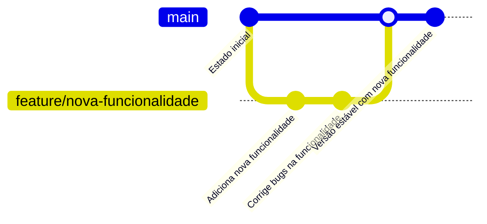
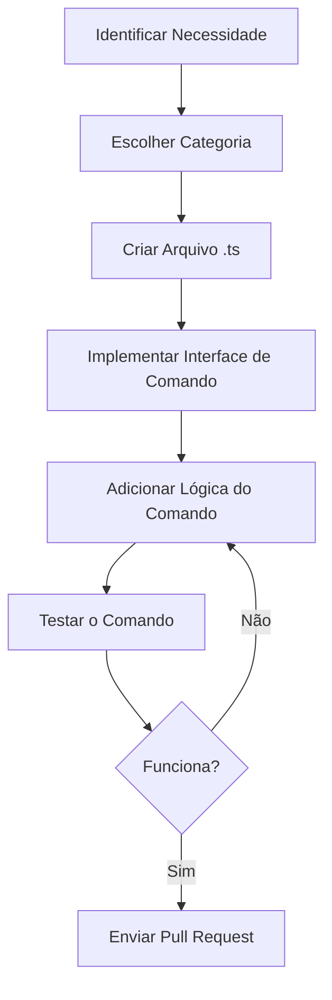

# Guia de Contribuição

![[contributing-banner.png]]

## 🚀 Como Contribuir para o NeroBot

Ficamos felizes com seu interesse em contribuir para o NeroBot! Este guia foi criado para ajudar os novos colaboradores a entenderem o processo de contribuição e as diretrizes que seguimos.

> [!tip] Dica Importante
> Antes de começar a contribuir, certifique-se de ler todo este guia para entender nosso fluxo de trabalho e padrões de código.

## 📋 Índice

1. [Código de Conduta](#código-de-conduta)
2. [Configuração do Ambiente](#configuração-do-ambiente)
3. [Fluxo de Trabalho de Contribuição](#fluxo-de-trabalho-de-contribuição)
4. [Diretrizes de Estilo de Código](#diretrizes-de-estilo-de-código)
5. [Adicionando Novos Comandos](#adicionando-novos-comandos)
6. [Testando Suas Alterações](#testando-suas-alterações)
7. [Enviando um Pull Request](#enviando-um-pull-request)
8. [Revisão de Código](#revisão-de-código)

## 📜 Código de Conduta

Esperamos que todos os colaboradores sigam nosso Código de Conduta:

- 🤝 **Respeito Mútuo**: Tratar a todos com respeito, independentemente de sua experiência, gênero, orientação sexual, deficiência, aparência, raça, ou religião.
- 🔍 **Crítica Construtiva**: Ao revisar código ou discutir ideias, seja construtivo e respeitoso.
- 🌱 **Mentalidade de Crescimento**: Estamos todos aprendendo e crescendo juntos. Sejamos pacientes e úteis.
- 🚫 **Zero Tolerância para Assédio**: Não toleramos assédio ou comportamento abusivo.

## 🛠️ Configuração do Ambiente

Para contribuir com o NeroBot, você precisará configurar seu ambiente de desenvolvimento:

```bash
# 1. Faça um fork do repositório
# Visite https://github.com/nome-do-usuario/nerobot e clique no botão "Fork"

# 2. Clone seu fork
git clone https://github.com/seu-usuario/nerobot.git
cd nerobot

# 3. Instale as dependências
npm install

# 4. Configure um ambiente de desenvolvimento
cp .env.example .env
# Edite o arquivo .env com suas configurações

# 5. Compile o código
npm run build

# 6. Execute o bot em modo de desenvolvimento
npm run dev
```

## 🔄 Fluxo de Trabalho de Contribuição

Seguimos um fluxo de trabalho baseado em branches e pull requests:



1. **Crie uma Branch**: Para cada contribuição, crie uma branch específica:
   ```bash
   git checkout -b feature/nome-da-funcionalidade
   # ou
   git checkout -b fix/nome-do-bug
   ```

2. **Faça Commits Pequenos e Claros**: Use mensagens de commit descritivas que expliquem o que foi feito e por quê.
   ```bash
   git commit -m "feat: adiciona comando para clima"
   git commit -m "fix: corrige problema na resposta do comando clima"
   ```

3. **Sincronize com o Repositório Principal**: Mantenha sua branch atualizada:
   ```bash
   git fetch upstream
   git rebase upstream/main
   ```

## 💻 Diretrizes de Estilo de Código

Para manter a consistência do código, seguimos estas diretrizes:

### TypeScript

- ✅ Use tipagem explícita para APIs públicas
- ✅ Prefira interfaces para definições de API
- ✅ Use camelCase para variáveis e funções
- ✅ Use PascalCase para classes e interfaces
- ✅ Adicione comentários JSDoc para documentar funções
- ❌ Evite o uso de `any`; prefira `unknown` quando necessário
- ❌ Não deixe código comentado

### Exemplo de Estilo Recomendado

```typescript
/**
 * Interface para parâmetros de verificação de permissão
 */
interface CheckPermissionParams {
  type: string;
  remoteJid: string | null;
  userJid: string | null;
  socket: WaBotClient;
}

/**
 * Verifica se um usuário tem permissão para executar um comando
 * @param params Parâmetros de verificação
 * @returns Verdadeiro se o usuário tem permissão, falso caso contrário
 */
export const checkPermission = async ({
  type,
  remoteJid,
  userJid,
  socket,
}: CheckPermissionParams): Promise<boolean> => {
  if (!type || !remoteJid || !userJid) {
    return false;
  }

  if (type === "owner") {
    return await isOwner({ remoteJid, userJid, socket });
  }

  if (type === "admin") {
    return await isAdmin({ remoteJid, userJid, socket });
  }

  return true;
};
```

## 🤖 Adicionando Novos Comandos

Para adicionar um novo comando ao NeroBot, siga estes passos:

### 1. Identifique a Categoria

Escolha a categoria adequada para seu comando:
- `admin`: Comandos para administradores de grupos
- `member`: Comandos para membros comuns
- `owner`: Comandos exclusivos para o dono do bot

### 2. Crie o Arquivo de Comando

Crie um novo arquivo na pasta correspondente:

```typescript
// src/commands/member/exemplo.ts
import { PREFIX } from "../../config";
import { CommandHandlerParams } from "../../types/commands";

export const name = "exemplo";
export const description = "Descrição do comando exemplo";
export const commands = ["exemplo", "ex"]; // Comando principal e aliases
export const usage = `${PREFIX}exemplo [parâmetro]`;

export const handle = async ({
  args,
  sendReply,
  sendReact,
}: CommandHandlerParams): Promise<void> => {
  // Verificação de argumentos
  if (args.length < 1) {
    await sendReply("Você precisa fornecer um parâmetro!");
    return;
  }

  // Lógica do comando
  const resposta = `Você enviou: ${args.join(" ")}`;
  
  // Enviar reação e resposta
  await sendReact("✅");
  await sendReply(resposta);
};
```

### 3. Teste Seu Comando

Teste seu comando para garantir que ele funciona corretamente:

```bash
# Compile o projeto
npm run build

# Execute o bot
npm run dev

# Teste seu comando em um grupo do WhatsApp: /exemplo teste
```

### Diagrama de Fluxo para Criação de Comandos



## 🧪 Testando Suas Alterações

Antes de enviar sua contribuição, certifique-se de testar suas alterações:

1. **Testes Unitários**: Se você adicionou uma função utilitária, considere adicionar testes unitários.
   ```bash
   npm test
   ```

2. **Testes Manuais**: Teste seu código em um ambiente real:
   - Todos os comandos funcionam como esperado?
   - O bot responde corretamente a eventos?
   - As permissões funcionam adequadamente?

3. **Verificação de Tipos**: Certifique-se de que não há erros de tipo:
   ```bash
   npm run build
   ```

## 📤 Enviando um Pull Request

Quando estiver pronto para enviar suas alterações:

1. **Faça Push da Sua Branch**:
   ```bash
   git push origin feature/nome-da-funcionalidade
   ```

2. **Crie um Pull Request**: Vá até o repositório no GitHub e crie um novo pull request.

3. **Descreva Suas Alterações**:
   - Explique o que suas alterações fazem
   - Mencione quaisquer problemas relacionados
   - Inclua screenshots se aplicável
   - Explique como testar suas alterações

### Modelo de Descrição do Pull Request

```markdown
## Descrição
Este PR adiciona um novo comando `/clima` que permite aos usuários consultarem a previsão do tempo para uma cidade.

## Mudanças
- Adiciona novo comando `/clima`
- Integra com a API OpenWeatherMap
- Adiciona novos tipos para a resposta da API

## Como Testar
1. Execute o bot com `npm run dev`
2. Use o comando `/clima São Paulo`
3. Verifique se a previsão do tempo é exibida corretamente

## Screenshots


## Issues Relacionadas
Resolve #123
```

## 👀 Revisão de Código

Após enviar seu pull request, ele será revisado pelos mantenedores. Você pode esperar:

- Comentários sobre melhorias específicas
- Sugestões de estilo de código
- Pedidos para testes adicionais
- Aprovação e mesclagem

Seja receptivo ao feedback e esteja disposto a fazer ajustes conforme necessário.

## 🏆 Reconhecimento

Todos os contribuidores são reconhecidos em nosso arquivo CONTRIBUTORS.md. Valorizamos cada contribuição, não importa o tamanho!

## 🔗 Links Úteis

- [Documentação do TypeScript](https://www.typescriptlang.org/docs/)
- [Documentação do Baileys](https://github.com/WhiskeySockets/Baileys)
- [Padrões de Commit Convencionais](https://www.conventionalcommits.org/)
- [[00-Visão Geral]] - Retornar à visão geral
- [[04-Sistema de Tipos]] - Entender o sistema de tipos

---

Agradecemos por considerar contribuir para o NeroBot! Juntos, podemos criar um bot incrível que beneficia a todos! 🚀 